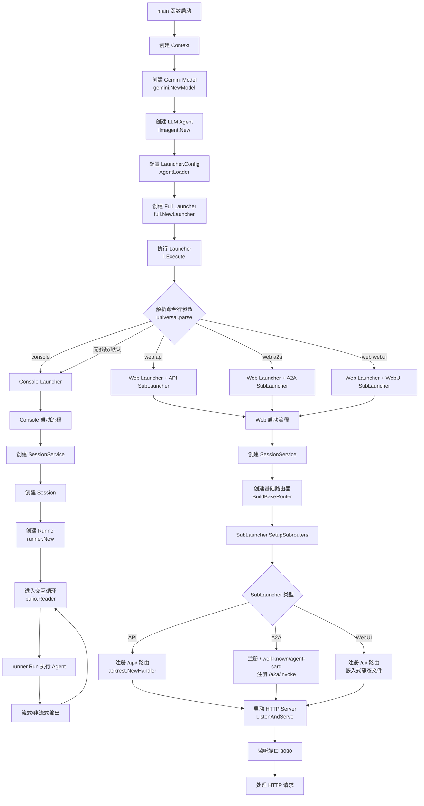
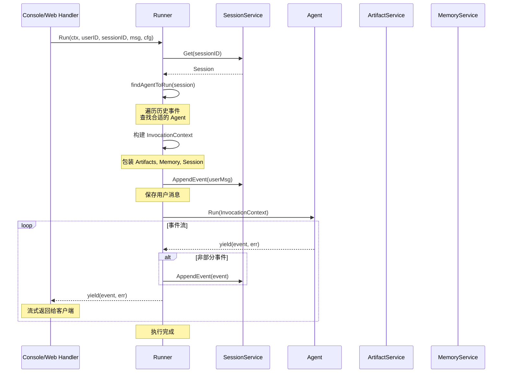
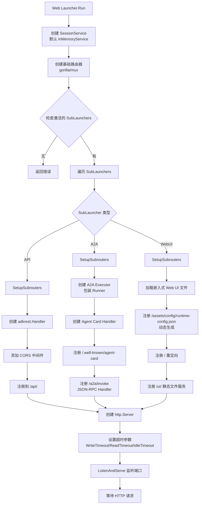
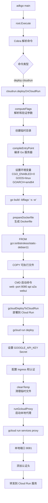

# 程序入口与启动流程

本文档详细描述了 ADK-Go 项目的程序入口、CLI 命令系统、服务启动流程以及启动时序。

---

## 1. 入口函数列表

ADK-Go 项目包含多个 `main()` 入口点，主要分为三类：示例程序、CLI 工具和直接服务器实现。

### 1.1 示例程序入口（Examples）

这些入口函数展示了如何使用 ADK-Go 框架构建不同类型的 Agent 应用。

#### 基础示例

| 文件路径 | 功能描述 | 使用的 Launcher |
|---------|---------|----------------|
| `examples/quickstart/main.go` | 快速入门示例：天气和时间查询 Agent | `full.NewLauncher()` |
| `examples/tools/multipletools/main.go` | 多工具使用示例 | `full.NewLauncher()` |
| `examples/tools/loadartifacts/main.go` | Artifact 加载示例 | `full.NewLauncher()` |
| `examples/mcp/main.go` | Model Context Protocol 集成示例 | `full.NewLauncher()` |
| `examples/vertexai/imagegenerator/main.go` | Vertex AI 图像生成示例 | `full.NewLauncher()` |

#### 工作流 Agent 示例

| 文件路径 | 功能描述 |
|---------|---------|
| `examples/workflowagents/loop/main.go` | 循环执行的 Agent（LoopAgent） |
| `examples/workflowagents/parallel/main.go` | 并行执行的 Agent（ParallelAgent） |
| `examples/workflowagents/sequential/main.go` | 顺序执行的 Agent（SequentialAgent） |
| `examples/workflowagents/sequentialCode/main.go` | 代码化顺序 Agent |

#### 服务器部署示例

| 文件路径 | 功能描述 | 服务类型 |
|---------|---------|---------|
| `examples/rest/main.go` | REST API 服务器（直接使用 `net/http`） | REST API |
| `examples/a2a/main.go` | Agent-to-Agent 协议服务器 | A2A + 远程 Agent |
| `examples/web/main.go` | Web 服务器（未在当前上下文中） | Web |

**关键入口函数特征**：
- 所有示例程序均位于 `examples/` 目录
- 大部分使用 `full.NewLauncher()` 提供完整的启动模式（console、restapi、a2a、webui）
- 典型启动模式：`go run ./examples/quickstart/main.go [console|web api|web a2a|web webui]`

### 1.2 CLI 工具入口

**文件**: `cmd/adkgo/adkgo.go`

```go
func main() {
    root.Execute()
}
```

- **框架**: 使用 Cobra CLI 框架（`github.com/spf13/cobra`）
- **功能**: 提供命令行工具用于部署和测试 ADK 应用
- **入口**: `cmd/adkgo/internal/root/root.go:Execute()`

---

## 2. CLI 命令系统

### 2.1 Cobra 命令结构

ADK-Go 使用 **Cobra** 框架构建 CLI 工具，命令树结构如下：

```
adkgo (root)
└── deploy
    └── cloudrun
```

#### Root 命令

**定义**: `cmd/adkgo/internal/root/root.go`

```go
var RootCmd = &cobra.Command{
    Use:   "adkgo",
    Short: "CLI tool for use with ADK-GO",
    Long:  `adkgo is a CLI tool which allows developer to quickly deploy and test an agentic application`,
}
```

#### Deploy 命令

**定义**: `cmd/adkgo/internal/deploy/deploy.go`

```go
var DeployCmd = &cobra.Command{
    Use:   "deploy",
    Short: "Makes deployment to various platforms easy",
    Long:  `Please see subcommands for details`,
}
```

**子命令**: `cloudrun`

#### CloudRun 子命令

**定义**: `cmd/adkgo/internal/deploy/cloudrun/cloudrun.go`

**功能**:
- 编译 Go 服务器可执行文件（静态链接，Linux/AMD64）
- 生成 Dockerfile（基于 `gcr.io/distroless/static-debian11`）
- 使用 `gcloud` 部署到 Google Cloud Run
- 启动本地认证代理（`gcloud run services proxy`）

**主要标志（Flags）**:
- `-r, --region`: GCP 区域
- `-p, --project_name`: GCP 项目名称
- `-s, --service_name`: Cloud Run 服务名称
- `-e, --entry_point_path`: 入口点路径（Go main 文件）
- `--a2a`: 启用 A2A 协议（默认 true）
- `--api`: 启用 REST API（默认 true）
- `--webui`: 启用 Web UI（默认 true）
- `--proxy_port`: 本地代理端口（默认 8081）
- `--server_port`: Cloud Run 服务器端口（默认 8080）

**执行流程**:
```
computeFlags → compileEntryPoint → prepareDockerfile → gcloudDeployToCloudRun → cleanTemp → runGcloudProxy
```

### 2.2 可用命令示例

```bash
# 部署到 Cloud Run
adkgo deploy cloudrun \
  -r us-central1 \
  -p my-project \
  -s my-agent-service \
  -e ./examples/quickstart/main.go

# 查看帮助
adkgo --help
adkgo deploy --help
adkgo deploy cloudrun --help
```

---

## 3. Launcher 框架与服务启动

ADK-Go 提供了灵活的 **Launcher** 框架，支持多种运行模式。

### 3.1 Launcher 接口

**定义**: `cmd/launcher/launcher.go`

```go
type Launcher interface {
    Execute(ctx context.Context, config *Config, args []string) error
    CommandLineSyntax() string
}

type SubLauncher interface {
    Keyword() string
    Parse(args []string) ([]string, error)
    CommandLineSyntax() string
    SimpleDescription() string
    Run(ctx context.Context, config *Config) error
}
```

**核心配置**: `launcher.Config`

```go
type Config struct {
    SessionService  session.Service
    ArtifactService artifact.Service
    MemoryService   memory.Service
    AgentLoader     agent.Loader
    A2AOptions      []a2asrv.RequestHandlerOption
}
```

### 3.2 Launcher 类型

#### Full Launcher

**文件**: `cmd/launcher/full/full.go`

```go
func NewLauncher() launcher.Launcher {
    return universal.NewLauncher(
        console.NewLauncher(),
        web.NewLauncher(
            api.NewLauncher(),
            a2a.NewLauncher(),
            webui.NewLauncher(),
        ),
    )
}
```

**支持模式**:
- `console`: 命令行交互模式
- `web api`: REST API 服务器
- `web a2a`: Agent-to-Agent 协议服务器
- `web webui`: Web UI 界面

#### Prod Launcher

**文件**: `cmd/launcher/prod/prod.go`

```go
func NewLauncher() launcher.Launcher {
    return universal.NewLauncher(
        web.NewLauncher(
            api.NewLauncher(),
            a2a.NewLauncher(),
        ),
    )
}
```

**支持模式**（生产环境）:
- `web api`: REST API 服务器
- `web a2a`: Agent-to-Agent 协议服务器

#### Universal Launcher

**文件**: `cmd/launcher/universal/universal.go`

**功能**: 路由器模式，根据命令行参数选择具体的 SubLauncher

**解析逻辑**:
1. 如果命令行参数为空，使用第一个 SubLauncher（默认）
2. 如果第一个参数匹配某个 SubLauncher 的 Keyword，使用该 SubLauncher
3. 否则，使用第一个 SubLauncher 并传递所有参数

### 3.3 启动模式详解

#### Console 模式

**文件**: `cmd/launcher/console/console.go:Run()`

**启动流程**:
1. 创建或获取 SessionService（默认 `session.InMemoryService()`）
2. 创建新的 Session（`sessionService.Create()`）
3. 创建 Runner（`runner.New()`）
4. 进入交互循环：
   - 读取用户输入（`bufio.Reader`）
   - 调用 `runner.Run()` 执行 Agent
   - 流式或非流式输出响应

**支持参数**:
- `-streaming_mode`: 流模式（`none` 或 `sse`，默认 `sse`）

#### Web 模式

**文件**: `cmd/launcher/web/web.go:Run()`

**启动流程**:
1. 创建 SessionService（默认 `session.InMemoryService()`）
2. 构建基础路由器（`BuildBaseRouter()`，使用 `gorilla/mux`）
3. 为每个激活的 SubLauncher 调用 `SetupSubrouters()`
4. 启动 HTTP 服务器（`http.Server.ListenAndServe()`）

**支持参数**:
- `-port`: 服务器端口（默认 8080）
- `-write-timeout`: 写超时（默认 15s）
- `-read-timeout`: 读超时（默认 15s）
- `-idle-timeout`: 空闲超时（默认 60s）

**Web SubLaunchers**:

##### 1. API SubLauncher

**文件**: `cmd/launcher/web/api/api.go`

- **路由**: `/api/`
- **Handler**: `adkrest.NewHandler(config)`
- **功能**: ADK REST API（支持 CORS）
- **参数**: `-webui_address`（CORS 源地址，默认 `localhost:8080`）

##### 2. A2A SubLauncher

**文件**: `cmd/launcher/web/a2a/a2a.go`

- **路由**:
  - `/.well-known/agent-card`: Agent 卡片（静态）
  - `/a2a/invoke`: JSON-RPC 调用端点
- **协议**: Agent-to-Agent（A2A）JSON-RPC
- **功能**: 创建 A2A Executor，处理 Agent 调用
- **参数**: `-a2a_agent_url`（Agent 卡片 URL，默认 `http://localhost:8080`）

##### 3. WebUI SubLauncher

**文件**: `cmd/launcher/web/webui/webui.go`

- **路由**: `/ui/`（默认）
- **功能**: 提供嵌入式 Web UI（静态文件来自 `embed.FS`）
- **特殊路由**:
  - `/assets/config/runtime-config.json`: 动态生成配置
  - `/`: 重定向到 `/ui/`
- **参数**: `-api_server_address`（API 服务器地址，默认 `http://localhost:8080/api`）

---

## 4. Runner 执行流程

Runner 是 ADK-Go 的核心执行引擎，负责在 Session 中运行 Agent。

### 4.1 Runner 初始化

**文件**: `runner/runner.go:New()`

```go
func New(cfg Config) (*Runner, error) {
    // 验证必需参数
    if cfg.Agent == nil {
        return nil, fmt.Errorf("root agent is required")
    }
    if cfg.SessionService == nil {
        return nil, fmt.Errorf("session service is required")
    }

    // 构建 Agent 父子关系映射
    parents, err := parentmap.New(cfg.Agent)

    return &Runner{
        appName:         cfg.AppName,
        rootAgent:       cfg.Agent,
        sessionService:  cfg.SessionService,
        artifactService: cfg.ArtifactService,
        memoryService:   cfg.MemoryService,
        parents:         parents,
    }, nil
}
```

### 4.2 Runner 执行流程

**文件**: `runner/runner.go:Run()`

**核心步骤**:

1. **获取 Session**
   ```go
   resp, err := r.sessionService.Get(ctx, &session.GetRequest{...})
   session := resp.Session
   ```

2. **查找要运行的 Agent**
   ```go
   agentToRun, err := r.findAgentToRun(session)
   ```
   - 遍历 Session 历史事件（从最新到最旧）
   - 查找最后一个非用户事件的 Agent
   - 检查 Agent 是否允许跨树转移（`DisallowTransferToParent`）
   - 如果没有找到，则使用 Root Agent

3. **构建 InvocationContext**
   ```go
   ctx = icontext.NewInvocationContext(ctx, icontext.InvocationContextParams{
       Artifacts:   artifacts,      // ArtifactService 包装
       Memory:      memoryImpl,     // MemoryService 包装
       Session:     mutableSession,  // SessionService 包装
       Agent:       agentToRun,
       UserContent: msg,
       RunConfig:   &cfg,
   })
   ```

4. **保存用户消息到 Session**
   ```go
   r.appendMessageToSession(ctx, session, msg, cfg.SaveInputBlobsAsArtifacts)
   ```
   - 如果配置了 `SaveInputBlobsAsArtifacts`，将 Blob 保存为 Artifact
   - 创建用户事件并追加到 Session

5. **执行 Agent 并处理事件流**
   ```go
   for event, err := range agentToRun.Run(ctx) {
       if !event.LLMResponse.Partial {
           r.sessionService.AppendEvent(ctx, session, event)
       }
       yield(event, err)
   }
   ```
   - 使用 Go 1.24+ 迭代器（`iter.Seq2[*session.Event, error]`）
   - 非部分事件（Partial=false）会被保存到 Session
   - 通过 `yield` 流式返回事件给调用者

---

## 5. 启动时序流程图

### 5.1 示例程序启动流程（Quickstart）



### 5.2 Runner 执行时序



### 5.3 Web 服务器启动流程



### 5.4 CLI 工具启动流程（adkgo deploy cloudrun）



---

## 6. 关键函数调用链

### 6.1 Console 模式启动

```
main()
└── full.NewLauncher()
    └── universal.NewLauncher(console.NewLauncher(), web.NewLauncher(...))
        └── Execute(ctx, config, args)
            └── parse(args)
                └── console.Parse(args)
            └── run(ctx, config)
                └── console.Run(ctx, config)
                    ├── session.InMemoryService()
                    ├── sessionService.Create()
                    ├── runner.New(runner.Config{...})
                    └── 交互循环
                        └── runner.Run(ctx, userID, sessionID, msg, cfg)
                            ├── sessionService.Get()
                            ├── findAgentToRun(session)
                            ├── icontext.NewInvocationContext()
                            ├── appendMessageToSession()
                            └── agent.Run(ctx)  // iter.Seq2 迭代器
```

### 6.2 Web 模式启动（API + A2A）

```
main()
└── full.NewLauncher()
    └── universal.NewLauncher(console, web.NewLauncher(api, a2a, webui))
        └── Execute(ctx, config, ["web", "api", "a2a"])
            └── parse(["web", "api", "a2a"])
                ├── web.Parse(["api", "a2a"])
                │   ├── api.Parse([])
                │   └── a2a.Parse([])
            └── run(ctx, config)
                └── web.Run(ctx, config)
                    ├── session.InMemoryService()
                    ├── BuildBaseRouter()
                    ├── api.SetupSubrouters(router, config)
                    │   └── router.Handle("/api/", adkrest.NewHandler(config))
                    ├── a2a.SetupSubrouters(router, config)
                    │   ├── router.Handle("/.well-known/agent-card", ...)
                    │   └── router.Handle("/a2a/invoke", a2asrv.NewJSONRPCHandler(...))
                    └── http.ListenAndServe(":8080", router)
```

### 6.3 Runner 执行链

```
runner.Run(ctx, userID, sessionID, msg, cfg)
└── sessionService.Get(sessionID)
└── findAgentToRun(session)
    └── 遍历 session.Events()（从新到旧）
        └── findAgent(rootAgent, event.Author)
        └── isTransferableAcrossAgentTree(agent)
└── parentmap.ToContext(ctx)
└── runconfig.ToContext(ctx)
└── icontext.NewInvocationContext(ctx, params)
└── appendMessageToSession(ctx, session, msg)
    └── sessionService.AppendEvent(ctx, session, userEvent)
└── agent.Run(ctx)  // iter.Seq2[*session.Event, error]
    └── for event, err := range ...
        ├── sessionService.AppendEvent(event)  // 仅非部分事件
        └── yield(event, err)  // 流式返回
```

---

## 7. 配置加载与依赖初始化

### 7.1 配置来源

ADK-Go 的配置主要来自以下几个方面：

1. **命令行参数**: 通过 Launcher 的 Flag 系统
   - Console: `-streaming_mode`
   - Web: `-port`, `-write-timeout`, `-read-timeout`, `-idle-timeout`
   - API: `-webui_address`
   - A2A: `-a2a_agent_url`
   - WebUI: `-api_server_address`

2. **环境变量**:
   - `GOOGLE_API_KEY`: Gemini API 密钥（在示例中使用）
   - Cloud Run 部署时通过 Secret 管理

3. **代码配置**:
   - `launcher.Config`: Agent 加载器、服务配置
   - `runner.Config`: AppName、Agent、各种 Service
   - `llmagent.Config`: Model、指令、工具等

### 7.2 依赖初始化顺序

#### Console 模式

```
1. Context (context.Background())
2. Model (gemini.NewModel() 或其他)
3. Agent (llmagent.New() 或其他类型)
4. launcher.Config (AgentLoader)
5. Full Launcher (full.NewLauncher())
6. SessionService (session.InMemoryService() - 运行时创建)
7. Session (sessionService.Create() - 运行时创建)
8. Runner (runner.New() - 运行时创建)
```

#### Web 模式

```
1-5. 同 Console 模式
6. SessionService (session.InMemoryService() - 运行时创建)
7. Router (mux.NewRouter())
8. SubLaunchers 初始化
   ├── API: adkrest.NewHandler(config)
   ├── A2A: adka2a.NewExecutor() + a2asrv.NewHandler()
   └── WebUI: embed.FS 加载静态文件
9. http.Server (配置超时参数)
10. ListenAndServe (开始监听)
```

---

## 8. 总结

### 8.1 入口函数总结

- **示例程序**: 12+ 个示例，主要使用 `full.NewLauncher()`
- **CLI 工具**: `cmd/adkgo/adkgo.go`，基于 Cobra 框架
- **服务器实现**: 可直接使用 `net/http` 或通过 Launcher 框架

### 8.2 启动模式总结

| 模式 | Keyword | 功能 | 主要组件 |
|------|---------|------|---------|
| Console | `console` | 命令行交互 | `bufio.Reader`, `runner.Run()` |
| Web API | `web api` | REST API 服务器 | `adkrest.Handler`, `/api/` |
| Web A2A | `web a2a` | Agent-to-Agent 协议 | `a2asrv.Handler`, `/a2a/invoke` |
| Web UI | `web webui` | Web 界面 | 嵌入式静态文件, `/ui/` |

### 8.3 关键设计模式

1. **组合模式**: Universal Launcher 组合多个 SubLaunchers
2. **策略模式**: 不同的 SubLauncher 实现不同的启动策略
3. **工厂模式**: `agent.New()`, `llmagent.New()`, `runner.New()`
4. **迭代器模式**: Go 1.24+ `iter.Seq2` 用于事件流
5. **中间件模式**: Web 路由的 CORS、日志中间件

### 8.4 技术栈

- **CLI 框架**: Cobra (`github.com/spf13/cobra`)
- **HTTP 路由**: Gorilla Mux (`github.com/gorilla/mux`)
- **A2A 协议**: `github.com/a2aproject/a2a-go`
- **LLM SDK**: `google.golang.org/genai`
- **并发**: Go 迭代器（`iter.Seq2`）

---

**文档版本**: v1.0
**最后更新**: 2025-11-17
**维护者**: ADK-Go Team
