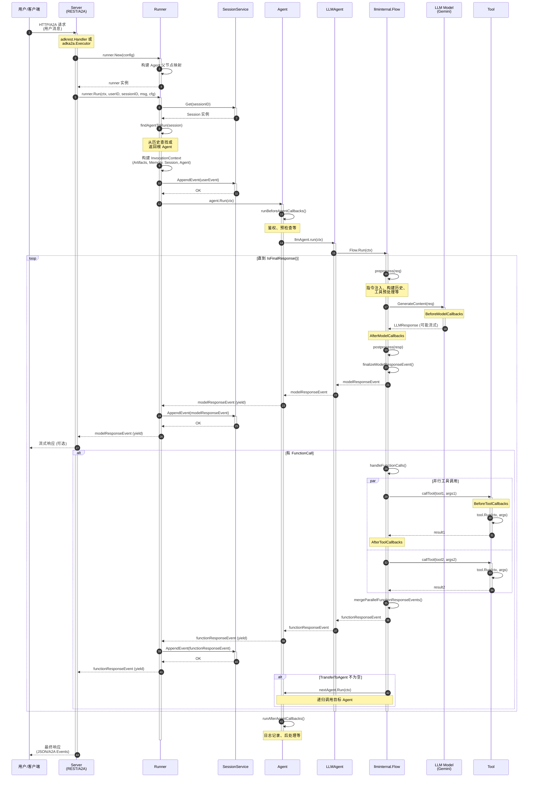

# 03-callchains.md

本文档详细说明 ADK-Go 项目的核心调用链，包括完整的函数调用树、关键分支标注以及主干调用时序图。

---

## 目录

1. [核心调用链概览](#核心调用链概览)
2. [应用程序启动流程](#应用程序启动流程)
3. [REST API 请求处理流程](#rest-api-请求处理流程)
4. [A2A 协议请求处理流程](#a2a-协议请求处理流程)
5. [Runner 核心执行流程](#runner-核心执行流程)
6. [Agent 执行流程](#agent-执行流程)
7. [LLMAgent 执行流程](#llmagent-执行流程)
8. [Tool 调用流程](#tool-调用流程)
9. [Session 管理流程](#session-管理流程)
10. [主干调用时序图](#主干调用时序图)

---

## 核心调用链概览

ADK-Go 的核心调用链主要分为以下几个层次：

```
应用启动 → Launcher → Server (REST/A2A) → Runner → Agent → LLMAgent → LLM Model/Tools
                                                ↓
                                           Session Service
```

---

## 应用程序启动流程

### 函数调用树

```
main()                                        // examples/quickstart/main.go:32
├── gemini.NewModel()                         // model/gemini/gemini.go
│   └── genai.NewClient()                     // 外部依赖：google.golang.org/genai
│
├── llmagent.New()                            // agent/llmagent/llmagent.go:33
│   └── agent.New()                           // agent/agent.go:49
│       └── 创建 agent 结构体并验证配置
│
└── launcher.Execute()                        // cmd/launcher/full 或 prod
    ├── 解析命令行参数                          // 根据模式 (console/restapi/a2a/webui)
    ├── 创建 SessionService (内存或数据库)       // session/inmemory.go 或 database/service.go
    ├── 创建 ArtifactService (可选)            // artifact/inmemory.go 或 gcsartifact
    ├── 创建 MemoryService (可选)              // memory/inmemory.go
    └── 启动对应模式
        ├── console: 启动命令行交互循环
        ├── restapi: 启动 HTTP 服务器
        ├── a2a: 启动 A2A 服务器
        └── webui: 启动 Web UI 服务器
```

### 关键函数说明

| 函数 | 文件路径 | 作用 |
|------|---------|------|
| `main()` | `examples/quickstart/main.go:32` | 应用程序入口，初始化模型、创建 Agent、配置 Launcher |
| `gemini.NewModel()` | `model/gemini/gemini.go` | 创建 Gemini 模型实例，封装 genai 客户端 |
| `llmagent.New()` | `agent/llmagent/llmagent.go:33` | 创建 LLM Agent，配置指令、工具、回调等 |
| `agent.New()` | `agent/agent.go:49` | 创建基础 Agent 结构，验证配置，设置子 Agent |
| `launcher.Execute()` | `cmd/launcher/*` | 根据命令行参数启动不同模式 (console/REST/A2A/WebUI) |

### 关键分支

- **模式选择**: 根据命令行参数 (`console`, `restapi`, `a2a`, `webui`) 决定启动哪种服务
- **服务初始化**: SessionService、ArtifactService、MemoryService 可选配置
- **错误处理**: 每个步骤都有严格的错误检查和日志记录

---

## REST API 请求处理流程

### 函数调用树

```
HTTP Request
│
└── adkrest.NewHandler()                      // server/adkrest/handler.go:31
    ├── routers.NewSessionsAPIRouter()        // 处理 /sessions/* 路由
    ├── routers.NewRuntimeAPIRouter()         // 处理 /runtime/* 路由
    │   └── controllers.NewRuntimeAPIRouter() // server/adkrest/controllers/runtime.go
    │       └── 最终调用 Runner.Run()
    ├── routers.NewAppsAPIRouter()            // 处理 /apps/* 路由
    ├── routers.NewDebugAPIRouter()           // 处理 /debug/* 路由
    └── routers.NewArtifactsAPIRouter()       // 处理 /artifacts/* 路由
```

### 关键函数说明

| 函数 | 文件路径 | 作用 |
|------|---------|------|
| `NewHandler()` | `server/adkrest/handler.go:31` | 创建 REST API 的 HTTP Handler，设置所有路由 |
| `NewSessionsAPIRouter()` | `server/adkrest/internal/routers/sessions.go` | 处理 Session 相关的 CRUD 操作 |
| `NewRuntimeAPIRouter()` | `server/adkrest/internal/routers/runtime.go` | 处理 Agent 运行时请求，调用 Runner.Run() |
| `NewAppsAPIRouter()` | `server/adkrest/internal/routers/apps.go` | 处理应用级别的信息查询 |

### 关键分支

- **路由分发**: 根据 URL 路径分发到不同的 Controller
- **中间件**: OpenTelemetry Span 导出器用于追踪
- **错误处理**: HTTP 错误码映射和 JSON 响应

---

## A2A 协议请求处理流程

### 函数调用树

```
A2A Request
│
└── adka2a.Executor.Execute()                 // server/adka2a/executor.go:58
    ├── toGenAIContent()                      // server/adka2a/parts.go
    │   └── 将 A2A Message 转换为 genai.Content
    │
    ├── runner.New()                          // runner/runner.go:53
    │   └── 创建 Runner 实例
    │
    ├── prepareSession()                      // server/adka2a/executor.go:148
    │   ├── sessionService.Get()              // 尝试获取 Session
    │   └── sessionService.Create()           // 不存在则创建 Session
    │
    ├── queue.Write(TaskStateSubmitted)       // 写入任务提交事件
    ├── queue.Write(TaskStateWorking)         // 写入任务工作中事件
    │
    ├── process()                             // server/adka2a/executor.go:112
    │   ├── runner.Run()                      // 运行 Agent，返回事件迭代器
    │   │   └── for event, err := range r.Run()
    │   │
    │   └── eventProcessor.process()          // server/adka2a/processor.go
    │       ├── 转换 session.Event 为 a2a.Event
    │       ├── TaskArtifactUpdateEvent       // 增量更新 Artifact
    │       └── 处理 LongRunningToolIDs
    │
    └── makeTerminalEvents()                  // server/adka2a/processor.go
        ├── TaskArtifactUpdateEvent (LastChunk=true)
        └── TaskStatusUpdateEvent (Completed/Failed/InputRequired)
```

### 关键函数说明

| 函数 | 文件路径 | 作用 |
|------|---------|------|
| `Executor.Execute()` | `server/adka2a/executor.go:58` | A2A 执行器入口，处理整个 A2A 请求生命周期 |
| `toGenAIContent()` | `server/adka2a/parts.go` | 将 A2A 消息格式转换为 genai.Content |
| `prepareSession()` | `server/adka2a/executor.go:148` | 准备或创建 Session |
| `process()` | `server/adka2a/executor.go:112` | 执行 Runner 并处理事件流 |
| `eventProcessor.process()` | `server/adka2a/processor.go` | 将 session.Event 转换为 a2a.Event |
| `makeTerminalEvents()` | `server/adka2a/processor.go` | 生成终止事件 (完成/失败/需要输入) |

### 关键分支

- **Session 准备**: 如果 Session 不存在则创建
- **任务状态转换**: Submitted → Working → (Completed/Failed/InputRequired)
- **事件转换**: session.Event → a2a.Event (保持协议兼容性)
- **错误处理**: 失败时生成 TaskStateFailed 事件而非直接返回错误
- **长运行工具**: 识别长运行工具并设置 TaskStateInputRequired

---

## Runner 核心执行流程

### 函数调用树

```
runner.New()                                  // runner/runner.go:53
├── 验证配置 (Agent, SessionService 必需)
└── parentmap.New()                           // internal/agent/parentmap/map.go
    └── 构建 Agent 树的父节点映射

runner.Run()                                  // runner/runner.go:93
├── sessionService.Get()                      // runner/runner.go:98
│   └── 获取或创建 Session
│
├── findAgentToRun()                          // runner/runner.go:110 → runner.go:215
│   ├── 从 Session 历史中倒序查找最后一个 Agent
│   ├── findAgent()                           // runner/runner.go:258
│   │   └── 递归查找目标 Agent (深度优先搜索)
│   └── isTransferableAcrossAgentTree()       // runner/runner.go:243
│       └── 检查 Agent 及其父链是否允许转移
│
├── 构建 InvocationContext                    // runner/runner.go:116-148
│   ├── parentmap.ToContext()                 // 注入父节点映射
│   ├── runconfig.ToContext()                 // 注入运行配置
│   ├── artifactinternal.Artifacts            // 创建 Artifact 服务包装
│   ├── imemory.Memory                        // 创建 Memory 服务包装
│   └── icontext.NewInvocationContext()       // internal/context/invocation_context.go
│       └── 封装所有上下文信息
│
├── appendMessageToSession()                  // runner/runner.go:150 → runner.go:178
│   ├── 处理 SaveInputBlobsAsArtifacts        // 保存输入的二进制数据为 Artifact
│   │   └── artifactsService.Save()
│   └── sessionService.AppendEvent()          // 将用户消息追加到 Session
│
└── for event, err := range agentToRun.Run(ctx)  // runner/runner.go:155
    ├── yield(event, err)                     // 返回事件给调用方
    └── sessionService.AppendEvent()          // runner/runner.go:165
        └── 保存非 Partial 事件到 Session
```

### 关键函数说明

| 函数 | 文件路径 | 作用 |
|------|---------|------|
| `runner.New()` | `runner/runner.go:53` | 创建 Runner 实例，验证配置，构建 Agent 树父节点映射 |
| `runner.Run()` | `runner/runner.go:93` | Runner 主入口，协调整个 Agent 执行流程 |
| `findAgentToRun()` | `runner/runner.go:215` | 根据 Session 历史确定下一个要执行的 Agent |
| `findAgent()` | `runner/runner.go:258` | 在 Agent 树中递归查找指定名称的 Agent (DFS) |
| `isTransferableAcrossAgentTree()` | `runner/runner.go:243` | 检查 Agent 及其父链是否允许向上转移 |
| `appendMessageToSession()` | `runner/runner.go:178` | 将用户消息追加到 Session，可选保存 Blob 为 Artifact |

### 关键分支

- **Agent 选择**:
  - 从 Session 历史倒序查找最后一个非 user 的 Agent
  - 检查该 Agent 是否允许转移 (DisallowTransferToParent)
  - 如果无法确定则回退到根 Agent

- **上下文构建**:
  - InvocationContext 封装了 Artifacts, Memory, Session, Agent, UserContent, RunConfig
  - 使用 Go context.Context 传递父节点映射和运行配置

- **事件处理**:
  - Partial 事件 (流式响应中间结果) 不会保存到 Session
  - 只有完整事件才会持久化

- **错误处理**:
  - 使用迭代器模式 (iter.Seq2) 优雅处理错误
  - 错误会通过 yield(nil, err) 返回给调用方

---

## Agent 执行流程

### 函数调用树

```
agent.Run()                                   // agent/agent.go:156
├── 创建 invocationContext                    // agent/agent.go:159-171
│   └── 封装 artifacts, memory, session, agent 等
│
├── runBeforeAgentCallbacks()                 // agent/agent.go:173 → agent.go:218
│   ├── for callback in beforeAgentCallbacks
│   │   └── callback(callbackContext)         // 执行前置回调
│   ├── 如果回调返回 content 或 error
│   │   ├── 创建 Event                        // agent/agent.go:236-244
│   │   └── ctx.EndInvocation()               // 标记 Invocation 结束
│   └── 如果有 StateDelta 则创建 Event        // agent/agent.go:248-253
│
├── if ctx.Ended()                            // agent/agent.go:180
│   └── return                                // 提前结束
│
├── customRunFunc(ctx)                        // agent/agent.go:184
│   └── for event, err := range a.run(ctx)    // 自定义 Run 函数或 LLMAgent.run()
│       ├── 设置 Event.Author                  // agent/agent.go:185-186
│       └── yield(event, err)                 // 返回事件
│
├── if ctx.Ended()                            // agent/agent.go:193
│   └── return                                // 提前结束
│
└── runAfterAgentCallbacks()                  // agent/agent.go:197 → agent.go:261
    ├── for callback in afterAgentCallbacks
    │   └── callback(callbackContext)         // 执行后置回调
    ├── 如果回调返回 content 或 error
    │   ├── 创建 Event                        // agent/agent.go:279-288
    │   └── 返回事件
    └── 如果有 StateDelta 则创建 Event        // agent/agent.go:292-297
```

### 关键函数说明

| 函数 | 文件路径 | 作用 |
|------|---------|------|
| `agent.Run()` | `agent/agent.go:156` | Agent 基础执行框架，协调回调和自定义 Run 函数 |
| `runBeforeAgentCallbacks()` | `agent/agent.go:218` | 执行前置回调，可提前结束 Agent 运行 |
| `customRunFunc()` | `agent/agent.go:184` | 自定义 Run 函数 (或 LLMAgent.run()) |
| `runAfterAgentCallbacks()` | `agent/agent.go:261` | 执行后置回调，可追加额外事件 |
| `getAuthorForEvent()` | `agent/agent.go:208` | 根据 Event 内容确定 Author (user 或 Agent 名称) |

### 关键分支

- **BeforeAgentCallbacks**:
  - 如果任何回调返回 content 或 error，则跳过 Agent Run 和剩余回调
  - 用于实现鉴权、预检查、缓存等逻辑

- **自定义 Run 函数**:
  - 对于 LLMAgent，调用 `llmAgent.run()`
  - 对于自定义 Agent，调用用户提供的 Run 函数

- **AfterAgentCallbacks**:
  - 如果 BeforeAgentCallbacks 已经结束 Invocation，则跳过
  - 用于实现日志记录、后处理、状态修改等逻辑

- **StateDelta 处理**:
  - BeforeAgentCallbacks 和 AfterAgentCallbacks 可以修改 Session State
  - 如果有 StateDelta，会自动创建一个 Event 来持久化状态变更

- **EndInvocation**:
  - 回调可以调用 `ctx.EndInvocation()` 提前结束整个 Invocation

---

## LLMAgent 执行流程

### 函数调用树

```
llmAgent.run()                                // agent/llmagent/llmagent.go:319
├── icontext.NewInvocationContext()           // 更新上下文，设置当前 Agent
│
└── llminternal.Flow.Run()                    // internal/llminternal/base_flow.go:77
    └── for { runOneStep() }                  // 循环直到 IsFinalResponse()
        │
        └── runOneStep()                      // internal/llminternal/base_flow.go:105
            ├── preprocess()                  // base_flow.go:194
            │   ├── basicRequestProcessor     // basic_processor.go
            │   │   └── 设置基础配置 (temperature, safety_settings 等)
            │   ├── authPreprocessor          // other_processors.go
            │   │   └── 处理认证相关逻辑
            │   ├── instructionsRequestProcessor  // instruction_processor.go
            │   │   ├── 解析 Instruction 模板
            │   │   ├── 注入 Session State 变量 ({key})
            │   │   ├── 注入 Artifact 内容 ({artifact.name})
            │   │   └── 处理 GlobalInstruction
            │   ├── identityRequestProcessor  // other_processors.go
            │   │   └── 设置 Agent 身份信息
            │   ├── ContentsRequestProcessor  // contents_processor.go
            │   │   ├── 构建对话历史 (根据 IncludeContents)
            │   │   ├── 过滤分支 (Branch filtering)
            │   │   └── 处理 Thought 标记
            │   ├── nlPlanningRequestProcessor  // other_processors.go
            │   │   └── 处理自然语言规划
            │   ├── codeExecutionRequestProcessor  // other_processors.go
            │   │   └── 处理代码执行优化
            │   ├── AgentTransferRequestProcessor  // agent_transfer.go
            │   │   └── 构建 transfer_to_agent 工具
            │   ├── removeDisplayNameIfExists  // other_processors.go
            │   │   └── 移除 DisplayName (模型兼容性)
            │   └── toolPreprocess()          // base_flow.go:224
            │       └── for tool in tools
            │           └── tool.ProcessRequest()  // 工具级别的请求预处理
            │
            ├── callLLM()                     // base_flow.go:239
            │   ├── for callback in BeforeModelCallbacks  // base_flow.go:241
            │   │   └── callback(ctx, req)    // 模型调用前回调
            │   │       └── 可返回缓存结果跳过 LLM 调用
            │   │
            │   ├── model.GenerateContent()   // base_flow.go:262
            │   │   └── 调用 LLM 生成内容 (支持流式)
            │   │
            │   └── runAfterModelCallbacks()  // base_flow.go:263 → base_flow.go:290
            │       └── for callback in AfterModelCallbacks
            │           └── callback(ctx, resp, err)  // 模型调用后回调
            │
            ├── postprocess()                 // base_flow.go:126 → base_flow.go:303
            │   ├── nlPlanningResponseProcessor  // other_processors.go
            │   │   └── 处理规划结果
            │   └── codeExecutionResponseProcessor  // other_processors.go
            │       └── 处理代码执行结果
            │
            ├── finalizeModelResponseEvent()  // base_flow.go:150 → base_flow.go:327
            │   ├── PopulateClientFunctionCallID()  // 生成 FunctionCall ID
            │   ├── findLongRunningFunctionCallIDs()  // base_flow.go:347
            │   │   └── 识别长运行工具
            │   └── 创建 session.Event
            │
            ├── yield(modelResponseEvent)     // 返回模型响应事件
            │
            └── handleFunctionCalls()         // base_flow.go:159 → base_flow.go:364
                ├── for functionCall in resp.Content
                │   ├── callTool()            // base_flow.go:381 → base_flow.go:416
                │   │   ├── invokeBeforeToolCallbacks()  // base_flow.go:418 → base_flow.go:439
                │   │   │   └── for callback in BeforeToolCallbacks
                │   │   │       └── callback(ctx, tool, args)  // 工具调用前回调
                │   │   │
                │   │   ├── tool.Run()        // base_flow.go:423
                │   │   │   └── 执行工具逻辑
                │   │   │
                │   │   └── invokeAfterToolCallbacks()  // base_flow.go:428 → base_flow.go:454
                │   │       └── for callback in AfterToolCallbacks
                │   │           └── callback(ctx, tool, args, result, err)  // 工具调用后回调
                │   │
                │   └── 创建 FunctionResponse Event  // base_flow.go:385-404
                │
                ├── mergeParallelFunctionResponseEvents()  // base_flow.go:406 → base_flow.go:469
                │   └── 合并并行 FunctionCall 的响应
                │
                ├── yield(functionResponseEvent)  // 返回函数响应事件
                │
                └── 处理 TransferToAgent          // base_flow.go:177
                    └── nextAgent.Run(ctx)        // base_flow.go:185
                        └── 递归调用目标 Agent

maybeSaveOutputToState()                      // agent/llmagent/llmagent.go:343 → llmagent.go:353
└── 如果配置了 OutputKey，将 Agent 输出保存到 Session State
```

### 关键函数说明

| 函数 | 文件路径 | 作用 |
|------|---------|------|
| `llmAgent.run()` | `agent/llmagent/llmagent.go:319` | LLMAgent 运行入口，创建 Flow 并执行 |
| `Flow.Run()` | `internal/llminternal/base_flow.go:77` | LLM Flow 主循环，重复执行直到最终响应 |
| `Flow.runOneStep()` | `internal/llminternal/base_flow.go:105` | 执行一步：预处理→调用 LLM→后处理→处理函数调用 |
| `preprocess()` | `internal/llminternal/base_flow.go:194` | 请求预处理：指令、历史、工具等 |
| `instructionsRequestProcessor` | `internal/llminternal/instruction_processor.go` | 处理指令模板，注入 State 和 Artifact |
| `ContentsRequestProcessor` | `internal/llminternal/contents_processor.go` | 构建对话历史，处理分支过滤 |
| `AgentTransferRequestProcessor` | `internal/llminternal/agent_transfer.go` | 构建 transfer_to_agent 工具 |
| `callLLM()` | `internal/llminternal/base_flow.go:239` | 调用 LLM 模型，支持前后回调和流式响应 |
| `model.GenerateContent()` | `model/gemini/gemini.go` | 实际调用 Gemini API 生成内容 |
| `postprocess()` | `internal/llminternal/base_flow.go:303` | 响应后处理：规划、代码执行等 |
| `handleFunctionCalls()` | `internal/llminternal/base_flow.go:364` | 处理函数调用，执行工具并生成响应事件 |
| `callTool()` | `internal/llminternal/base_flow.go:416` | 调用单个工具，支持前后回调 |
| `maybeSaveOutputToState()` | `agent/llmagent/llmagent.go:353` | 保存 Agent 输出到 Session State (如果配置了 OutputKey) |

### 关键分支

- **请求预处理器链** (DefaultRequestProcessors):
  1. basicRequestProcessor: 基础配置
  2. authPreprocessor: 认证处理
  3. instructionsRequestProcessor: 指令注入
  4. identityRequestProcessor: 身份设置
  5. ContentsRequestProcessor: 对话历史
  6. nlPlanningRequestProcessor: NL 规划
  7. codeExecutionRequestProcessor: 代码执行
  8. AgentTransferRequestProcessor: Agent 转移工具
  9. removeDisplayNameIfExists: 移除 DisplayName

- **响应后处理器链** (DefaultResponseProcessors):
  1. nlPlanningResponseProcessor: 规划响应处理
  2. codeExecutionResponseProcessor: 代码执行响应处理

- **回调执行顺序**:
  1. BeforeModelCallbacks: 模型调用前 (可跳过实际 LLM 调用)
  2. model.GenerateContent: 实际 LLM 调用
  3. AfterModelCallbacks: 模型调用后 (可替换响应)
  4. BeforeToolCallbacks: 工具调用前 (可跳过实际 Tool 执行)
  5. tool.Run: 实际 Tool 执行
  6. AfterToolCallbacks: 工具调用后 (可替换结果)

- **流式响应**:
  - 根据 `runconfig.StreamingMode` 决定是否流式调用
  - Partial 事件用于流式响应中间结果
  - 只有 Partial=false 的事件会保存到 Session

- **Agent 转移**:
  - transfer_to_agent 工具由 AgentTransferRequestProcessor 自动生成
  - 转移目标包括：父 Agent、子 Agent、兄弟 Agent (根据配置)
  - 转移后会递归调用目标 Agent 的 Run()

- **循环终止条件**:
  - `IsFinalResponse()` 为 true 时终止
  - 即：无函数调用、无函数响应、非 Partial、无代码执行结果、无长运行工具

---

## Tool 调用流程

### 函数调用树

```
handleFunctionCalls()                         // internal/llminternal/base_flow.go:364
└── for functionCall in resp.Content.Parts
    ├── 查找 Tool                             // base_flow.go:369
    │   └── toolsDict[fnCall.Name]
    │
    └── callTool()                            // base_flow.go:381 → base_flow.go:416
        ├── invokeBeforeToolCallbacks()       // base_flow.go:418 → base_flow.go:439
        │   └── for callback in BeforeToolCallbacks
        │       └── callback(ctx, tool, args)
        │           ├── 可记录日志、验证参数
        │           └── 返回 result 跳过实际 Tool 执行
        │
        ├── tool.Run()                        // base_flow.go:423
        │   └── 具体 Tool 实现
        │       ├── functiontool.Run()        // tool/functiontool/function.go
        │       │   └── userFunc(ctx, args)
        │       ├── geminitool.GoogleSearch.Run()  // tool/geminitool/google_search.go
        │       │   └── 调用 Gemini Google Search API
        │       ├── agenttool.Run()           // tool/agenttool/agent_tool.go
        │       │   └── subAgent.Run(ctx)     // 委托给子 Agent
        │       ├── exitlooptool.Run()        // tool/exitlooptool/tool.go
        │       │   └── 返回退出循环信号
        │       └── loadartifactstool.Run()   // tool/loadartifactstool/load_artifacts_tool.go
        │           └── artifacts.Load()
        │
        └── invokeAfterToolCallbacks()        // base_flow.go:428 → base_flow.go:454
            └── for callback in AfterToolCallbacks
                └── callback(ctx, tool, args, result, err)
                    ├── 可记录日志、修改结果
                    └── 返回 result 替换原结果
```

### 关键函数说明

| 函数 | 文件路径 | 作用 |
|------|---------|------|
| `handleFunctionCalls()` | `internal/llminternal/base_flow.go:364` | 处理所有函数调用，支持并行调用 |
| `callTool()` | `internal/llminternal/base_flow.go:416` | 调用单个工具，协调回调和实际执行 |
| `invokeBeforeToolCallbacks()` | `internal/llminternal/base_flow.go:439` | 执行工具前回调，可跳过实际工具执行 |
| `invokeAfterToolCallbacks()` | `internal/llminternal/base_flow.go:454` | 执行工具后回调，可替换工具结果 |
| `tool.Run()` | 各 Tool 实现 | 实际执行工具逻辑 |
| `mergeParallelFunctionResponseEvents()` | `internal/llminternal/base_flow.go:469` | 合并并行函数调用的响应事件 |

### 具体 Tool 实现

| Tool 类型 | 文件路径 | 作用 |
|----------|---------|------|
| `functiontool` | `tool/functiontool/function.go` | 用户自定义函数工具，封装 Go 函数 |
| `geminitool.GoogleSearch` | `tool/geminitool/google_search.go` | Gemini Google Search 工具 |
| `agenttool` | `tool/agenttool/agent_tool.go` | Agent 委托工具，将任务委托给子 Agent |
| `exitlooptool` | `tool/exitlooptool/tool.go` | 退出循环工具 (用于 LoopAgent) |
| `loadartifactstool` | `tool/loadartifactstool/load_artifacts_tool.go` | 加载 Artifact 工具 |
| `mcptoolset` | `tool/mcptoolset/set.go` | Model Context Protocol 工具集 |

### 关键分支

- **并行工具调用**:
  - 如果 LLM 返回多个 FunctionCall，会并发执行所有工具
  - 所有工具结果会合并到一个 FunctionResponse Event

- **工具上下文** (tool.Context):
  - 提供 FunctionCallID、Session State、Artifacts、Memory、Actions
  - 工具可以修改 Session State 通过 Actions().StateDelta
  - 工具可以触发 Agent 转移通过 Actions().TransferToAgent

- **长运行工具**:
  - 通过 `tool.IsLongRunning()` 标识
  - 长运行工具 ID 会记录在 Event.LongRunningToolIDs
  - 客户端可以根据此字段显示不同的 UI

- **错误处理**:
  - 工具执行错误会被包装为 `{"error": "..."}`
  - 回调执行错误也会被包装
  - 错误不会中断流程，会作为 FunctionResponse 返回给 LLM

- **Agent Tool**:
  - agenttool 允许 LLM 委托任务给子 Agent
  - 子 Agent 的执行结果作为工具结果返回
  - 支持嵌套 Agent 调用

---

## Session 管理流程

### 函数调用树

```
session.Service 接口                          // session/service.go
├── Get()                                     // 获取 Session
│   └── inmemory.Get() / database.Get()
│       └── 从存储中查找 Session
│
├── Create()                                  // 创建 Session
│   └── inmemory.Create() / database.Create()
│       ├── 生成 SessionID (如果未提供)
│       └── 初始化 State 和 Events
│
├── AppendEvent()                             // 追加 Event
│   └── inmemory.AppendEvent() / database.AppendEvent()
│       ├── 应用 Event.Actions.StateDelta     // session/database/session.go
│       │   └── 更新 Session State
│       ├── 应用 Event.Actions.ArtifactDelta
│       │   └── 更新 Artifact 版本
│       └── 追加 Event 到 Events 列表
│
├── List()                                    // 列出 Session
│   └── inmemory.List() / database.List()
│
└── Delete()                                  // 删除 Session
    └── inmemory.Delete() / database.Delete()
```

### Session 数据结构

```go
Session 接口                                  // session/session.go:30
├── ID() string                               // Session 唯一标识
├── AppName() string                          // 应用名称
├── UserID() string                           // 用户 ID
├── State() State                             // 键值对状态存储
│   ├── Get(key) (any, error)
│   ├── Set(key, value) error
│   └── All() iter.Seq2[string, any]
├── Events() Events                           // 事件列表
│   ├── All() iter.Seq[*Event]
│   ├── Len() int
│   └── At(i) *Event
└── LastUpdateTime() time.Time               // 最后更新时间

Event 结构                                    // session/session.go:90
├── ID string                                 // Event 唯一标识
├── Timestamp time.Time                       // 时间戳
├── InvocationID string                       // Invocation 标识
├── Branch string                             // 分支 (agent_1.agent_2.agent_3)
├── Author string                             // 作者 (Agent 名称或 "user")
├── LLMResponse model.LLMResponse             // LLM 响应内容
│   ├── Content *genai.Content                // 内容 (Parts)
│   ├── Partial bool                          // 是否为流式响应中间结果
│   ├── ErrorCode string                      // 错误代码
│   └── ...
├── Actions EventActions                      // 事件动作
│   ├── StateDelta map[string]any             // 状态变更
│   ├── ArtifactDelta map[string]int64        // Artifact 版本变更
│   ├── SkipSummarization bool                // 跳过总结
│   ├── TransferToAgent string                // 转移到的 Agent
│   └── Escalate bool                         // 上报
└── LongRunningToolIDs []string               // 长运行工具 ID 列表
```

### 关键函数说明

| 函数 | 文件路径 | 作用 |
|------|---------|------|
| `session.Service` | `session/service.go` | Session 服务接口，定义 CRUD 操作 |
| `inmemory.Service` | `session/inmemory.go` | 内存实现，用于开发和测试 |
| `database.Service` | `session/database/service.go` | 数据库实现，用于生产环境 (GORM) |
| `Session.State` | `session/session.go:49` | 键值对状态存储接口 |
| `Session.Events` | `session/session.go:74` | 事件列表接口 |
| `NewEvent()` | `session/session.go:131` | 创建新 Event，生成 ID 和时间戳 |
| `Event.IsFinalResponse()` | `session/session.go:122` | 判断是否为最终响应 |

### Session State 作用域

| 前缀 | 作用域 | 说明 |
|------|-------|------|
| `app:` | 应用级别 | 所有用户和 Session 共享 (同一 app_name) |
| `user:` | 用户级别 | 同一用户的所有 Session 共享 (同一 user_id 和 app_name) |
| `temp:` | Invocation 级别 | 当前 Invocation 临时使用，结束后丢弃 |
| 无前缀 | Session 级别 | 当前 Session 独享 |

### 关键分支

- **存储实现选择**:
  - 内存实现 (`inmemory`): 适合开发、测试、单机部署
  - 数据库实现 (`database`): 适合生产环境、多实例部署 (使用 GORM)

- **Event 持久化**:
  - Partial Event 不会保存到 Session (流式响应中间结果)
  - 只有完整 Event 会持久化
  - AppendEvent 会自动应用 StateDelta 和 ArtifactDelta

- **State 更新**:
  - 通过 Event.Actions.StateDelta 批量更新
  - 支持多级作用域 (app/user/temp/session)
  - State 变更会在 AppendEvent 时应用

- **Branch 机制**:
  - Branch 格式: "agent_1.agent_2.agent_3"
  - 用于在多 Agent 场景下隔离对话历史
  - 子 Agent 只能看到自己分支的历史

- **错误处理**:
  - `ErrStateKeyNotExist`: State key 不存在
  - 数据库实现会处理并发、事务、连接池等

---

## 主干调用时序图

以下是 ADK-Go 主干调用链的 Mermaid 时序图，展示了一次完整的用户请求处理流程：



### 时序图说明

#### 关键步骤：

1. **请求接收**: Server 接收 HTTP/A2A 请求
2. **Runner 初始化**: 创建 Runner 实例，构建 Agent 树映射
3. **Runner 执行**: 调用 `runner.Run()`
4. **Session 获取**: 从 SessionService 获取或创建 Session
5. **Agent 查找**: 根据历史确定要执行的 Agent
6. **上下文构建**: 创建 InvocationContext，封装所有服务
7. **追加用户消息**: 将用户输入保存到 Session
8. **Agent 执行**: 调用 `agent.Run()`
9. **BeforeAgentCallbacks**: 执行前置回调
10. **LLMAgent 执行**: 调用 `llmAgent.run()`
11. **Flow 循环**: 重复执行直到最终响应
12. **预处理**: 处理指令、历史、工具等
13. **调用 LLM**: 调用模型生成内容 (支持流式)
14. **后处理**: 处理响应
15. **生成事件**: 创建 modelResponseEvent
16. **保存事件**: 追加到 Session
17. **返回事件**: 通过迭代器返回 (支持流式)
18. **处理函数调用**: 如果有 FunctionCall
19. **并行工具调用**: 并发执行所有工具
20. **合并响应**: 合并并行工具结果
21. **Agent 转移**: 如果需要，递归调用目标 Agent
22. **AfterAgentCallbacks**: 执行后置回调
23. **返回最终响应**: Server 返回给客户端

#### 并发和流式处理：

- **流式响应**:
  - Model.GenerateContent 支持流式返回
  - 每个 Partial Event 都会立即 yield 给调用方
  - Server 可以将流式事件转换为 SSE 或 A2A 增量事件

- **并行工具调用**:
  - 如果 LLM 返回多个 FunctionCall，会并发执行
  - 所有工具结果会合并到一个 Event

- **递归 Agent 调用**:
  - transfer_to_agent 工具会触发递归调用
  - 子 Agent 的所有事件都会通过迭代器返回

#### 错误处理：

- 每个步骤都通过 `iter.Seq2[*Event, error]` 返回
- 错误会通过 `yield(nil, err)` 传递给调用方
- Server 负责将错误转换为 HTTP 或 A2A 错误响应

---

## 总结

ADK-Go 的核心调用链展示了一个**事件驱动、流式处理、可扩展**的 AI Agent 框架架构：

### 核心特点：

1. **迭代器模式** (`iter.Seq2`):
   - 支持流式响应和事件处理
   - 优雅的错误传播机制
   - 天然支持背压 (backpressure)

2. **回调机制**:
   - BeforeAgent/AfterAgent 回调
   - BeforeModel/AfterModel 回调
   - BeforeTool/AfterTool 回调
   - 支持日志、缓存、鉴权、修改等场景

3. **处理器链**:
   - 请求预处理器链 (DefaultRequestProcessors)
   - 响应后处理器链 (DefaultResponseProcessors)
   - 可插拔的处理逻辑

4. **Agent 树和转移**:
   - 父节点映射 (parentmap)
   - 支持 Agent 间转移 (transfer_to_agent)
   - 分支机制隔离对话历史

5. **Session 管理**:
   - 多作用域 State (app/user/temp/session)
   - 事件溯源 (Event Sourcing)
   - 支持内存和数据库存储

6. **并发支持**:
   - 并行工具调用
   - 流式响应
   - Go 协程和 Channel

### 扩展点：

- **自定义 Agent**: 通过 `agent.New()` 实现自定义逻辑
- **自定义 Tool**: 通过 `functiontool.New()` 或实现 Tool 接口
- **自定义回调**: 在各个生命周期注入自定义逻辑
- **自定义处理器**: 添加到处理器链
- **自定义 Session/Artifact/Memory**: 实现对应接口

---

**文档版本**: 1.0
**生成时间**: 2025-11-17
**对应代码版本**: adk-go (当前)
