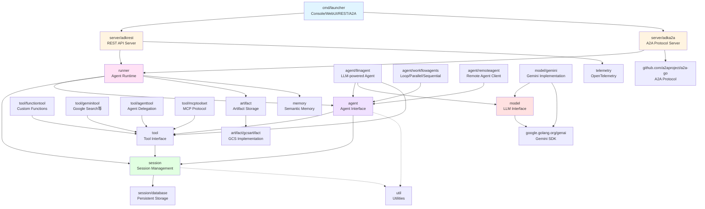
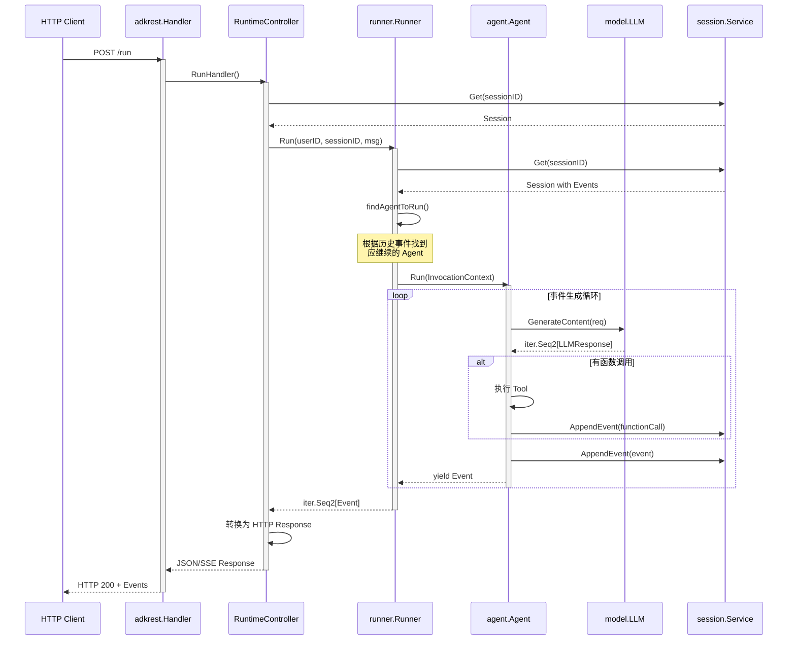
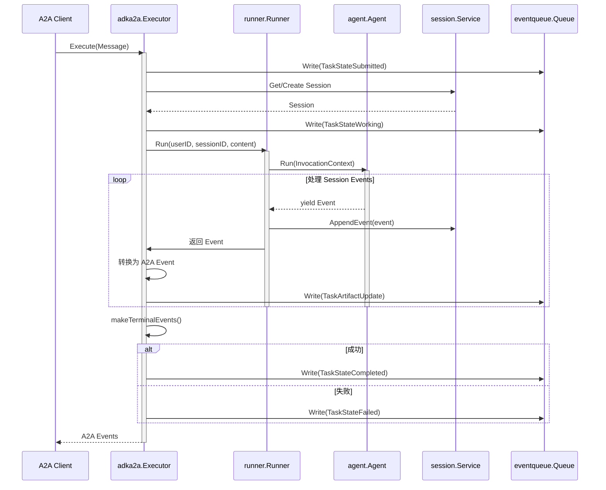
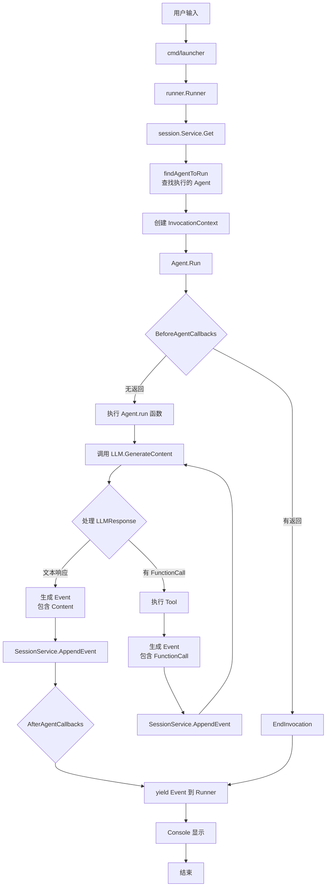
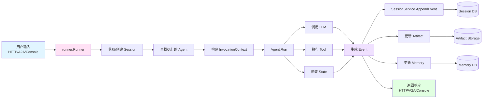
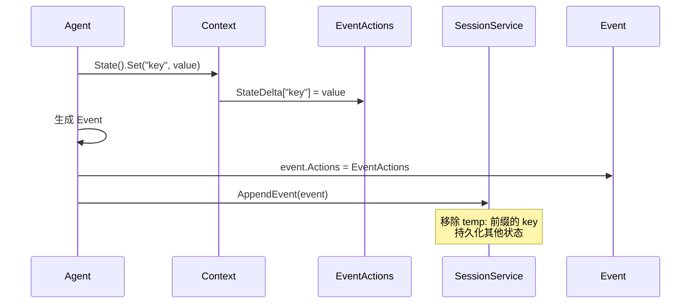

# 步骤四：模块依赖与数据流

> **文档版本**：v1.0
> **生成日期**：2025-11-17
> **适用项目**：ADK-Go (Agent Development Kit for Go)

---

## 一、模块依赖关系

### 1.1 核心模块依赖图



### 1.2 模块职责说明

| 模块分类 | 包路径 | 主要职责 |
|---------|--------|---------|
| **启动层** | `cmd/launcher` | 提供 Console、REST、A2A、WebUI 等启动模式 |
| **服务器层** | `server/adkrest` | REST API 服务器，处理 HTTP 请求 |
| | `server/adka2a` | Agent-to-Agent 协议服务器 |
| **运行时层** | `runner` | 管理 Agent 执行流程，协调各服务 |
| **Agent 层** | `agent` | Agent 基础接口和构造器 |
| | `agent/llmagent` | LLM 驱动的 Agent 实现 |
| | `agent/workflowagents` | 工作流 Agent（循环、并行、顺序） |
| | `agent/remoteagent` | 远程 Agent 客户端 |
| **会话层** | `session` | 会话管理、事件存储 |
| | `session/database` | 持久化会话存储（SQL） |
| **工具层** | `tool` | 工具接口定义 |
| | `tool/functiontool` | 自定义函数工具 |
| | `tool/geminitool` | Gemini 特有工具（搜索等） |
| | `tool/agenttool` | Agent 委托工具 |
| | `tool/mcptoolset` | MCP 协议工具集 |
| **模型层** | `model` | LLM 接口定义 |
| | `model/gemini` | Gemini 模型实现 |
| **存储层** | `artifact` | 文件存储服务接口 |
| | `artifact/gcsartifact` | GCS 实现 |
| | `memory` | 语义记忆服务接口 |
| **基础设施** | `telemetry` | OpenTelemetry 集成 |
| | `util` | 通用工具函数 |

---

## 二、重要数据结构

### 2.1 Agent 相关

#### Agent 接口
**文件**: `agent/agent.go:39-46`

```go
type Agent interface {
    Name() string
    Description() string
    Run(InvocationContext) iter.Seq2[*session.Event, error]
    SubAgents() []Agent
    internal() *agent
}
```

**职责**:
- 定义 Agent 的基本行为契约
- `Run` 方法返回事件迭代器，支持流式处理
- `SubAgents` 支持层级 Agent 结构

#### InvocationContext
**文件**: `agent/context.go`

```go
type InvocationContext interface {
    context.Context
    Agent() Agent
    Artifacts() Artifacts
    Memory() Memory
    Session() session.Session
    InvocationID() string
    Branch() string
    UserContent() *genai.Content
    RunConfig() *RunConfig
    EndInvocation()
    Ended() bool
}
```

**职责**:
- 为 Agent 执行提供上下文
- 提供会话、工具、记忆等服务的访问
- 管理调用生命周期

### 2.2 Session 相关

#### Session 接口
**文件**: `session/session.go:30-44`

```go
type Session interface {
    ID() string
    AppName() string
    UserID() string
    State() State
    Events() Events
    LastUpdateTime() time.Time
}
```

**职责**:
- 表示用户与 Agent 的一次对话会话
- 包含状态（State）和事件（Events）

#### Event 结构
**文件**: `session/session.go:90-116`

```go
type Event struct {
    model.LLMResponse

    // 由存储层设置
    ID        string
    Timestamp time.Time

    // 由 Agent Context 设置
    InvocationID string
    Branch       string    // 格式：agent_1.agent_2.agent_3
    Author       string

    // Agent 执行的操作
    Actions            EventActions
    LongRunningToolIDs []string
}
```

**职责**:
- 记录对话中的每一次交互
- 包含 LLM 响应、函数调用、状态变更等
- 不可变，由 SessionService 持久化

#### EventActions
**文件**: `session/session.go:141-156`

```go
type EventActions struct {
    StateDelta        map[string]any    // 状态变更
    ArtifactDelta     map[string]int64  // Artifact 更新
    SkipSummarization bool              // 跳过摘要
    TransferToAgent   string            // 转移到指定 Agent
    Escalate          bool              // 升级到上级 Agent
}
```

**职责**:
- 描述 Agent 在事件中执行的操作
- 支持状态变更、Agent 转移、Artifact 更新

### 2.3 Runner

#### Runner 结构
**文件**: `runner/runner.go:80-88`

```go
type Runner struct {
    appName         string
    rootAgent       agent.Agent
    sessionService  session.Service
    artifactService artifact.Service
    memoryService   memory.Service
    parents         parentmap.Map
}
```

**职责**:
- 管理 Agent 在 Session 中的执行
- 协调 SessionService、ArtifactService、MemoryService
- 处理用户输入，生成事件流

### 2.4 Tool 相关

#### Tool 接口
**文件**: `tool/tool.go:29-37`

```go
type Tool interface {
    Name() string
    Description() string
    IsLongRunning() bool
}
```

**职责**:
- 定义工具的基本契约
- `IsLongRunning()` 区分同步/异步工具

#### Tool Context
**文件**: `tool/tool.go:42-54`

```go
type Context interface {
    agent.CallbackContext
    FunctionCallID() string
    Actions() *session.EventActions
    SearchMemory(context.Context, string) (*memory.SearchResponse, error)
}
```

**职责**:
- 为工具执行提供上下文
- 允许工具修改状态、搜索记忆

### 2.5 Model 相关

#### LLM 接口
**文件**: `model/llm.go:26-29`

```go
type LLM interface {
    Name() string
    GenerateContent(ctx context.Context, req *LLMRequest, stream bool) iter.Seq2[*LLMResponse, error]
}
```

**职责**:
- 模型无关的 LLM 接口
- 支持流式和非流式生成

#### LLMRequest/Response
**文件**: `model/llm.go:31-62`

```go
type LLMRequest struct {
    Model    string
    Contents []*genai.Content
    Config   *genai.GenerateContentConfig
    Tools    map[string]any
}

type LLMResponse struct {
    Content           *genai.Content
    CitationMetadata  *genai.CitationMetadata
    GroundingMetadata *genai.GroundingMetadata
    UsageMetadata     *genai.GenerateContentResponseUsageMetadata
    CustomMetadata    map[string]any
    LogprobsResult    *genai.LogprobsResult
    Partial           bool
    TurnComplete      bool
    Interrupted       bool
    ErrorCode         string
    ErrorMessage      string
    FinishReason      genai.FinishReason
    AvgLogprobs       float64
}
```

### 2.6 Service 接口

#### SessionService
**文件**: `session/service.go:25-32`

```go
type Service interface {
    Create(context.Context, *CreateRequest) (*CreateResponse, error)
    Get(context.Context, *GetRequest) (*GetResponse, error)
    List(context.Context, *ListRequest) (*ListResponse, error)
    Delete(context.Context, *DeleteRequest) error
    AppendEvent(context.Context, Session, *Event) error
}
```

#### ArtifactService
**文件**: `artifact/service.go:31-45`

```go
type Service interface {
    Save(ctx context.Context, req *SaveRequest) (*SaveResponse, error)
    Load(ctx context.Context, req *LoadRequest) (*LoadResponse, error)
    Delete(ctx context.Context, req *DeleteRequest) error
    List(ctx context.Context, req *ListRequest) (*ListResponse, error)
    Versions(ctx context.Context, req *VersionsRequest) (*VersionsResponse, error)
}
```

#### MemoryService
**文件**: `memory/service.go:30-38`

```go
type Service interface {
    AddSession(ctx context.Context, s session.Session) error
    Search(ctx context.Context, req *SearchRequest) (*SearchResponse, error)
}
```

---

## 三、典型请求处理流程

### 3.1 REST API 请求处理流程



**关键步骤**:

1. **路由匹配**: `adkrest.Handler` → `RuntimeController.RunHandler`
   **文件**: `server/adkrest/handler.go:31-46`, `server/adkrest/internal/routers/runtime.go:36-50`

2. **Runner 执行**: `Runner.Run()` 处理用户输入
   **文件**: `runner/runner.go:93-176`

3. **Agent 查找**: `findAgentToRun()` 根据历史事件确定执行的 Agent
   **文件**: `runner/runner.go:215-240`

4. **Agent 执行**: `Agent.Run()` 生成事件流
   **文件**: `agent/agent.go:156-202`

5. **事件持久化**: `SessionService.AppendEvent()` 保存非部分事件
   **文件**: `runner/runner.go:164-169`

### 3.2 A2A 请求处理流程



**关键步骤**:

1. **协议转换**: A2A Message → GenAI Content
   **文件**: `server/adka2a/parts.go`

2. **任务状态管理**: Executor 生成 TaskStatus 事件
   **文件**: `server/adka2a/executor.go:58-146`

3. **事件处理**: EventProcessor 转换 Session Event → A2A Event
   **文件**: `server/adka2a/processor.go`

4. **终止状态**: 根据 LLMResponse 决定 Completed/Failed/InputRequired
   **文件**: `server/adka2a/executor.go:139-144`

### 3.3 Console 请求处理流程



**关键步骤**:

1. **Launcher 初始化**: `full.NewLauncher()` 或 `prod.NewLauncher()`
   **文件**: `cmd/launcher/full/launcher.go`, `cmd/launcher/prod/launcher.go`

2. **用户输入处理**: Console 模式读取 stdin
   **示例**: `examples/quickstart/main.go`

3. **Runner 执行**: 与 REST 流程相同

4. **事件显示**: Console 实时打印事件内容

### 3.4 数据流总览



---

## 四、API 接口定义

### 4.1 REST API 接口

#### Runtime API

| 路径 | 方法 | 入参 | 出参 | 中间件 | 文件位置 |
|------|------|------|------|--------|---------|
| `/run` | POST | `RunRequest`<br/>- `app_name`<br/>- `user_id`<br/>- `session_id`<br/>- `message` (Content)<br/>- `config` (RunConfig) | `RunResponse`<br/>- `events[]` (Event)<br/>- `session_id` | ErrorHandler | `server/adkrest/internal/routers/runtime.go:38-42` |
| `/run_sse` | POST | 同 `/run` | SSE Stream<br/>- 逐个发送 Event | ErrorHandler | `server/adkrest/internal/routers/runtime.go:44-48` |

#### Sessions API

| 路径 | 方法 | 入参 | 出参 | 中间件 | 文件位置 |
|------|------|------|------|--------|---------|
| `/apps/{app_name}/users/{user_id}/sessions` | GET | 路径参数 | `ListResponse`<br/>- `sessions[]` | - | `server/adkrest/internal/routers/sessions.go:61-65` |
| `/apps/{app_name}/users/{user_id}/sessions` | POST | `CreateRequest`<br/>- `state` (初始状态) | `CreateResponse`<br/>- `session` (Session) | - | `server/adkrest/internal/routers/sessions.go:42-46` |
| `/apps/{app_name}/users/{user_id}/sessions/{session_id}` | GET | 路径参数 | `GetResponse`<br/>- `session` (Session) | - | `server/adkrest/internal/routers/sessions.go:37-41` |
| `/apps/{app_name}/users/{user_id}/sessions/{session_id}` | POST | `CreateRequest` | `CreateResponse` | - | `server/adkrest/internal/routers/sessions.go:48-53` |
| `/apps/{app_name}/users/{user_id}/sessions/{session_id}` | DELETE | 路径参数 | - | - | `server/adkrest/internal/routers/sessions.go:55-59` |

#### Artifacts API

| 路径 | 方法 | 入参 | 出参 | 中间件 | 文件位置 |
|------|------|------|------|--------|---------|
| `/apps/{app_name}/users/{user_id}/sessions/{session_id}/artifacts` | GET | 路径参数 | `ListResponse`<br/>- `file_names[]` | - | `server/adkrest/internal/routers/artifacts.go:36-41` |
| `/apps/{app_name}/users/{user_id}/sessions/{session_id}/artifacts/{artifact_name}` | GET | 路径参数 | `LoadResponse`<br/>- `part` (genai.Part) | - | `server/adkrest/internal/routers/artifacts.go:42-47` |
| `/apps/{app_name}/users/{user_id}/sessions/{session_id}/artifacts/{artifact_name}/versions/{version}` | GET | 路径参数 | `LoadResponse` | - | `server/adkrest/internal/routers/artifacts.go:48-53` |
| `/apps/{app_name}/users/{user_id}/sessions/{session_id}/artifacts/{artifact_name}` | DELETE | 路径参数 | - | - | `server/adkrest/internal/routers/artifacts.go:54-59` |

#### Debug API

| 路径 | 方法 | 入参 | 出参 | 中间件 | 文件位置 |
|------|------|------|------|--------|---------|
| `/debug/trace/{event_id}` | GET | 路径参数 | Trace Dict (JSON) | - | `server/adkrest/internal/routers/debug.go:37-42` |
| `/apps/{app_name}/users/{user_id}/sessions/{session_id}/events/{event_id}/graph` | GET | 路径参数 | Agent Graph (JSON) | - | `server/adkrest/internal/routers/debug.go:43-48` |
| `/debug/trace/session/{session_id}` | GET | 路径参数 | Session Trace | Unimplemented | `server/adkrest/internal/routers/debug.go:49-54` |

### 4.2 A2A 协议接口

A2A 协议基于 `github.com/a2aproject/a2a-go` 实现，主要方法：

| 方法 | 入参 | 出参 | 文件位置 |
|------|------|------|---------|
| `Execute` | `RequestContext`<br/>- `Message` (a2a.Message)<br/>- `StoredTask` | `eventqueue.Queue`<br/>写入多个 a2a.Event | `server/adka2a/executor.go:58-101` |
| `Cancel` | `RequestContext` | `TaskStateCanceled` Event | `server/adka2a/executor.go:103-109` |

**事件类型**:
- `TaskStatusUpdateEvent`: 任务状态变更（Submitted/Working/Completed/Failed/Canceled）
- `TaskArtifactUpdateEvent`: 任务内容更新（流式传输）

---

## 五、关键处理层说明

### 5.1 处理层结构

```
HTTP/A2A Request
    ↓
[Server Layer] - adkrest/adka2a
    ↓
[Controller Layer] - controllers (REST only)
    ↓
[Runner Layer] - runner.Runner
    ↓
[Agent Layer] - agent.Agent
    ↓
[Model/Tool Layer] - model.LLM / tool.Tool
    ↓
[Service Layer] - session/artifact/memory.Service
    ↓
[Storage Layer] - Database/GCS/Memory
```

### 5.2 处理层职责

| 层级 | 职责 | 关键组件 |
|------|------|---------|
| **Server** | 协议处理（HTTP/A2A） | `adkrest.Handler`, `adka2a.Executor` |
| **Controller** | 请求验证、响应转换 | `RuntimeController`, `SessionsController` |
| **Runner** | 协调 Agent 执行、管理服务 | `runner.Runner` |
| **Agent** | 业务逻辑、对话流程 | `llmagent`, `workflowagents` |
| **Model** | LLM 调用 | `gemini.Model` |
| **Tool** | 扩展能力（搜索、计算等） | `functiontool`, `geminitool` |
| **Service** | 数据持久化、查询 | `session.Service`, `artifact.Service` |
| **Storage** | 底层存储 | SQL DB, GCS, In-Memory |

---

## 六、状态管理

### 6.1 Session State 作用域

| 前缀 | 作用域 | 生命周期 | 示例 |
|------|--------|---------|------|
| `app:` | 应用级 | 跨用户、跨会话 | `app:version` |
| `user:` | 用户级 | 跨会话（同一用户） | `user:preferences` |
| `temp:` | 临时 | 单次调用 | `temp:current_query` |
| (无前缀) | 会话级 | 当前会话 | `last_topic` |

**文件**: `session/session.go:159-172`

### 6.2 状态修改流程



---

## 七、总结

### 7.1 核心数据结构关系

```
Agent (执行逻辑)
  ↓ 生成
Event (交互记录)
  ↓ 包含
EventActions (状态变更/Agent转移)
  ↓ 影响
Session (会话状态)
```

### 7.2 关键流程

1. **用户输入** → Runner 获取 Session → 查找 Agent → Agent 执行
2. **Agent 执行** → 调用 LLM/Tool → 生成 Event → 更新 State
3. **Event 流** → SessionService 持久化 → 返回给客户端

### 7.3 扩展点

- **自定义 Agent**: 实现 `agent.Agent` 接口或使用 `agent.New`
- **自定义 Tool**: 实现 `tool.Tool` 接口或使用 `functiontool.New`
- **自定义存储**: 实现 `session.Service`/`artifact.Service` 接口
- **自定义模型**: 实现 `model.LLM` 接口

---

**文档完**
