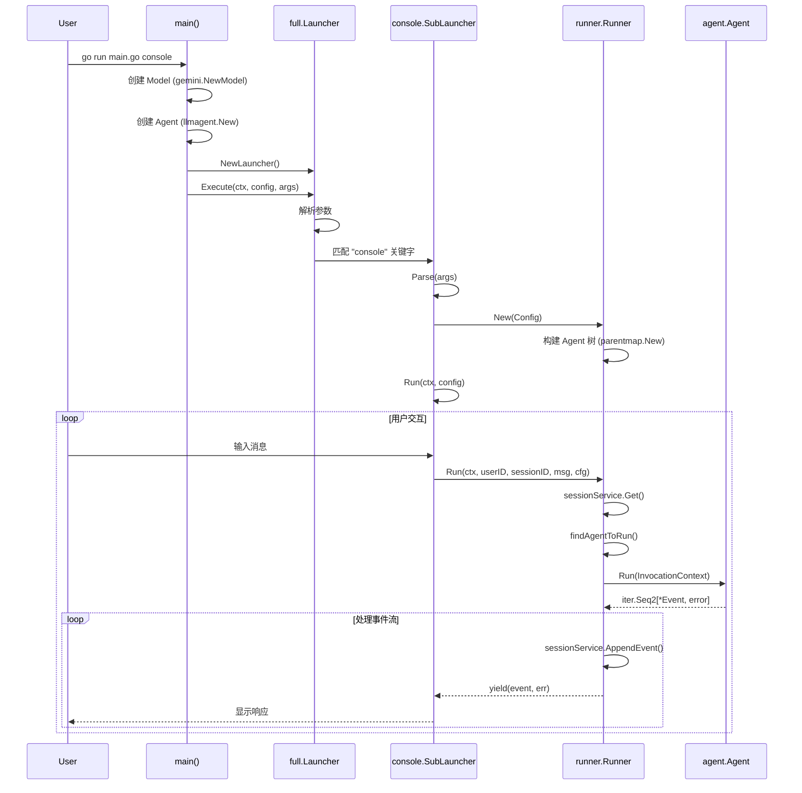
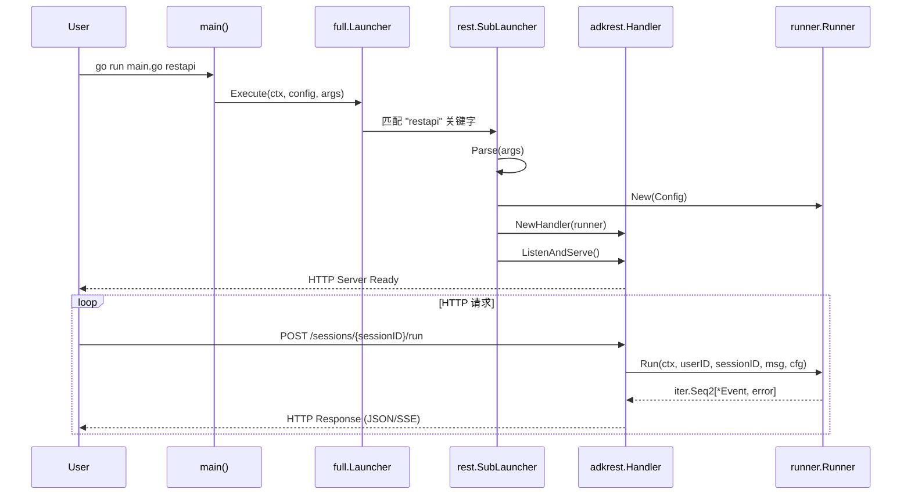
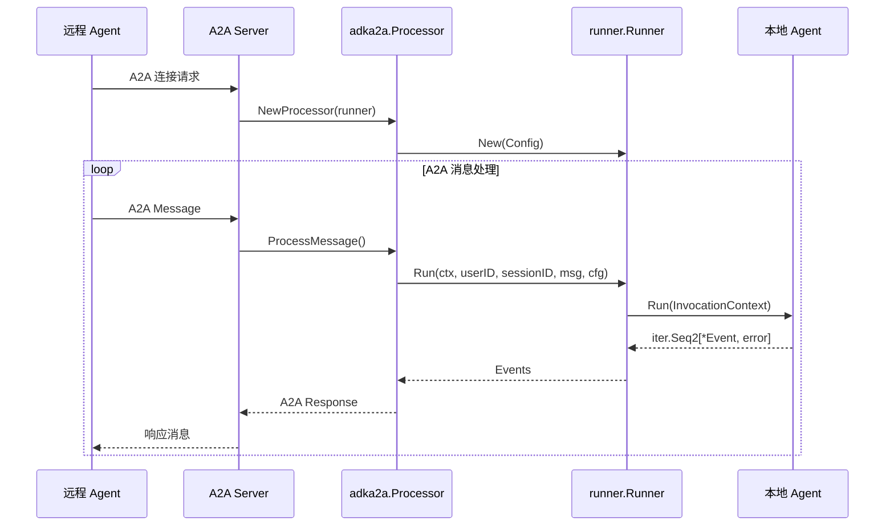
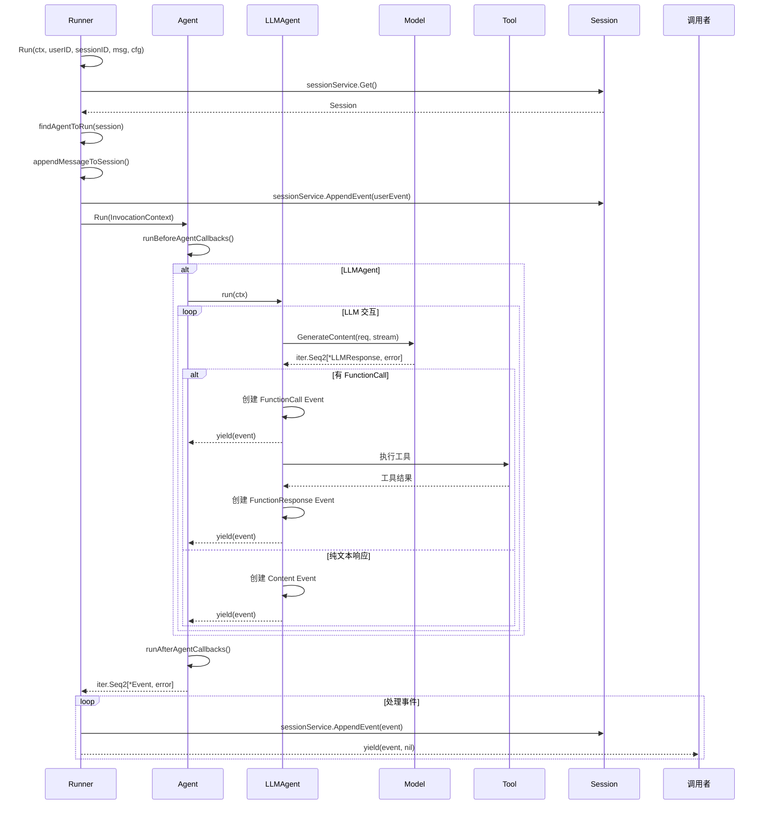
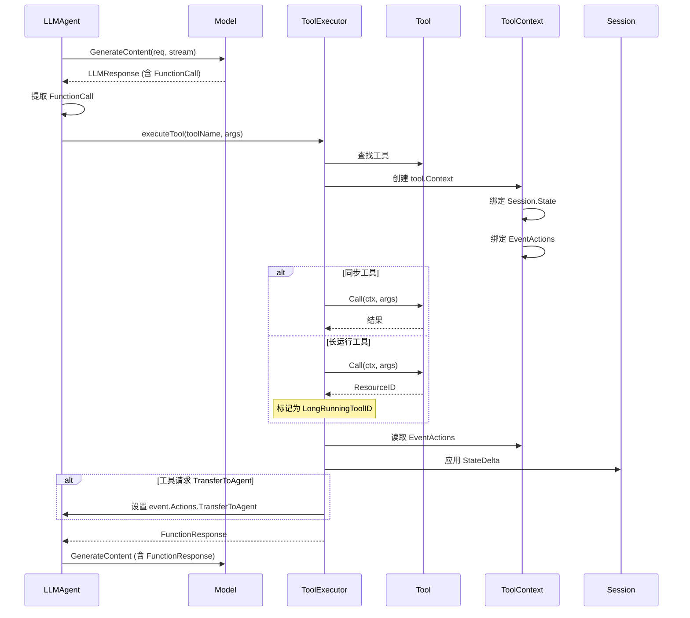
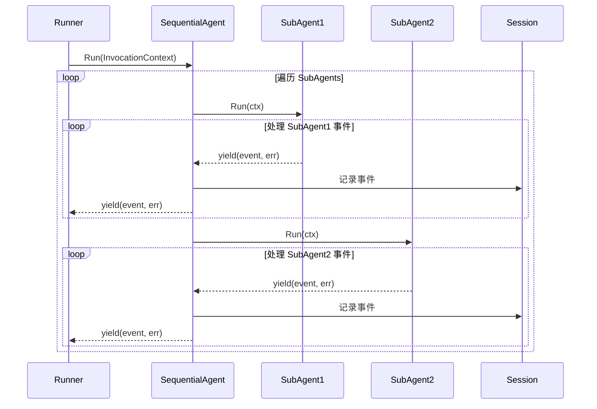
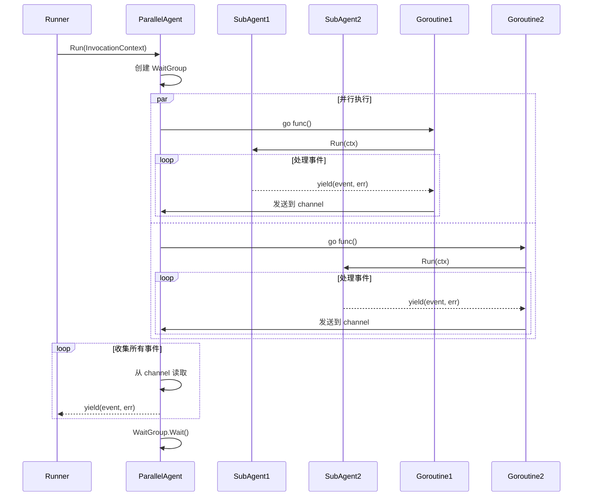
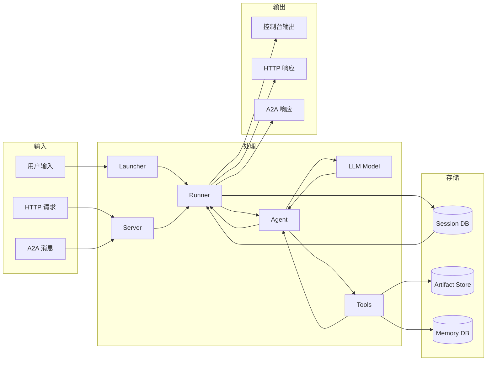

# 05-architecture.md - 系统架构

## 目录
- [系统整体架构综述](#系统整体架构综述)
- [顶层目录表](#顶层目录表)
- [启动流程图](#启动流程图)
- [核心调用链时序图](#核心调用链时序图)
- [模块依赖关系图](#模块依赖关系图)
- [外部依赖](#外部依赖)
- [配置项](#配置项)

---

## 系统整体架构综述

**ADK-Go (Agent Development Kit for Go)** 是一个灵活的、代码优先的 AI Agent 开发框架，专注于构建、部署和编排 AI Agent。

### 核心特点

1. **模型无关性**：支持任何 LLM 模型，优化支持 Gemini（通过 `google.golang.org/genai`）
2. **部署无关性**：支持多种部署模式（Console、REST API、A2A、WebUI）
3. **事件驱动架构**：基于不可变事件（`session.Event`）的流式处理
4. **迭代器模式**：使用 Go 1.24.4+ 的 `iter.Seq2` 实现反压控制和流式处理
5. **分层 Agent 架构**：支持 Agent 树形结构和任务委派
6. **可扩展工具系统**：同步/异步工具，支持动态工具选择

### 架构分层

```
┌─────────────────────────────────────────────────────────────┐
│                     应用层 (Examples)                        │
│  Quickstart │ Workflow Agents │ REST API │ A2A │ WebUI     │
└─────────────────────────────────────────────────────────────┘
                            ▼
┌─────────────────────────────────────────────────────────────┐
│                   启动器层 (Launcher)                        │
│         Full Launcher │ Prod Launcher │ CLI Tool            │
└─────────────────────────────────────────────────────────────┘
                            ▼
┌─────────────────────────────────────────────────────────────┐
│                    服务层 (Server)                           │
│            REST API Server │ A2A Protocol Server            │
└─────────────────────────────────────────────────────────────┘
                            ▼
┌─────────────────────────────────────────────────────────────┐
│                    运行时层 (Runner)                         │
│      Agent 执行 │ 事件处理 │ 服务编排                       │
└─────────────────────────────────────────────────────────────┘
                            ▼
┌─────────────────────────────────────────────────────────────┐
│                     核心层 (Core)                            │
│  Agent │ Session │ Tool │ Model │ Memory │ Artifact        │
└─────────────────────────────────────────────────────────────┘
                            ▼
┌─────────────────────────────────────────────────────────────┐
│                   基础设施层 (Infrastructure)                │
│    LLM APIs │ Storage │ Database │ Telemetry               │
└─────────────────────────────────────────────────────────────┘
```

### 核心执行流程

1. **用户请求** → Launcher 解析命令行参数
2. **初始化** → 创建 Agent、Model、Services
3. **请求处理** → Server 接收用户输入
4. **Agent 执行** → Runner 管理 Agent 运行
5. **事件流** → Agent.Run() 返回事件迭代器
6. **工具调用** → LLM 决策触发工具执行
7. **状态管理** → Session 持久化状态和事件
8. **响应返回** → 流式或批量返回事件

---

## 顶层目录表

| 目录 | 作用 | 关键文件 | 说明 |
|------|------|----------|------|
| **agent/** | Agent 核心接口和实现 | `agent.go`, `invocation_context.go`, `loader.go` | 定义 Agent 接口、调用上下文、加载器 |
| **agent/llmagent/** | LLM 驱动的 Agent | `llmagent.go`, `config.go` | 与 LLM 交互的 Agent 实现 |
| **agent/remoteagent/** | 远程 Agent 客户端 | `remoteagent.go` | 连接远程运行的 Agent |
| **agent/workflowagents/** | 工作流编排 Agent | `loopagent.go`, `parallelagent.go`, `sequentialagent.go` | 循环、并行、顺序执行模式 |
| **session/** | 会话管理 | `session.go`, `service.go`, `event.go` | 会话、事件、状态管理 |
| **session/database/** | 会话持久化 | `database.go` | 基于 GORM 的数据库存储 |
| **runner/** | Agent 运行时 | `runner.go` | 管理 Agent 在 Session 中的执行 |
| **tool/** | 工具接口 | `tool.go`, `context.go` | 工具定义和上下文 |
| **tool/functiontool/** | 自定义函数工具 | `functiontool.go` | 包装 Go 函数为工具 |
| **tool/geminitool/** | Gemini 专用工具 | `googlesearch.go`, `codeexecution.go` | Google Search、代码执行 |
| **tool/agenttool/** | Agent 委派工具 | `agenttool.go` | 将 Agent 作为工具使用 |
| **tool/mcptoolset/** | MCP 工具集 | `mcptoolset.go` | Model Context Protocol 集成 |
| **tool/exitlooptool/** | 循环退出工具 | `exitlooptool.go` | LoopAgent 的退出机制 |
| **tool/loadartifactstool/** | Artifact 加载工具 | `loadartifactstool.go` | 加载存储的 Artifact |
| **model/** | LLM 模型接口 | `llm.go` | LLM 请求/响应抽象 |
| **model/gemini/** | Gemini 模型实现 | `model.go`, `config.go` | Google Gemini 集成 |
| **server/** | 服务器协议 | `doc.go` | 服务器包文档 |
| **server/adkrest/** | REST API 服务器 | `handler.go`, `controllers/*` | HTTP REST 接口 |
| **server/adka2a/** | A2A 协议服务器 | `processor.go`, `executor.go` | Agent-to-Agent 通信 |
| **memory/** | 语义记忆服务 | `memory.go` | 跨会话记忆搜索 |
| **artifact/** | Artifact 存储接口 | `artifact.go` | 文件/数据存储抽象 |
| **artifact/gcsartifact/** | GCS Artifact 实现 | `gcsartifact.go` | Google Cloud Storage 集成 |
| **telemetry/** | OpenTelemetry 集成 | `telemetry.go` | 追踪和监控 |
| **util/** | 工具函数 | `util.go` | 共享工具函数 |
| **util/instructionutil/** | 指令工具 | `instructionutil.go` | 处理 Agent 指令 |
| **cmd/launcher/** | Launcher 框架 | `launcher.go`, `full/*.go`, `prod/*.go` | 启动器实现 |
| **cmd/adkgo/** | CLI 工具 | `main.go` | 命令行工具 |
| **examples/** | 示例应用 | `quickstart/`, `workflowagents/`, `rest/`, `a2a/`, `web/`, `mcp/`, `vertexai/` | 各种使用示例 |
| **internal/** | 内部实现 | `agent/`, `converters/`, `testutil/` | 非公开 API 的实现细节 |

---

## 启动流程图

### 1. Console 模式启动流程



### 2. REST API 模式启动流程



### 3. A2A 模式启动流程



---

## 核心调用链时序图

### 1. Agent 执行核心流程



### 2. 工具调用流程



### 3. Workflow Agent 执行流程

#### SequentialAgent



#### ParallelAgent



#### LoopAgent

```mermaid
sequenceDiagram
    participant Runner
    participant Loop as LoopAgent
    participant SubAgent
    participant ExitLoopTool

    Runner->>Loop: Run(InvocationContext)
    Loop->>Loop: 添加 ExitLoopTool

    loop 直到退出
        Loop->>SubAgent: Run(ctx)
        loop 处理事件
            SubAgent-->>Loop: yield(event, err)

            alt 检测到 ExitLoopTool 调用
                Loop->>Loop: exitLoop = true
                Loop-->>Runner: yield(event, err)
                Note over Loop: 跳出循环
            else 普通事件
                Loop-->>Runner: yield(event, err)
            end
        end
    end
```

---

## 模块依赖关系图

### 包依赖关系

```mermaid
graph TB
    subgraph "应用层"
        Examples[examples/*]
    end

    subgraph "启动层"
        Launcher[cmd/launcher]
        FullLauncher[cmd/launcher/full]
        ProdLauncher[cmd/launcher/prod]
        CLI[cmd/adkgo]
    end

    subgraph "服务层"
        RESTServer[server/adkrest]
        A2AServer[server/adka2a]
    end

    subgraph "运行时层"
        Runner[runner]
    end

    subgraph "核心层"
        Agent[agent]
        LLMAgent[agent/llmagent]
        RemoteAgent[agent/remoteagent]
        WorkflowAgents[agent/workflowagents]
        Session[session]
        SessionDB[session/database]
        Tool[tool]
        FunctionTool[tool/functiontool]
        GeminiTool[tool/geminitool]
        AgentTool[tool/agenttool]
        MCPToolset[tool/mcptoolset]
        Model[model]
        GeminiModel[model/gemini]
        Memory[memory]
        Artifact[artifact]
        GCSArtifact[artifact/gcsartifact]
        Telemetry[telemetry]
        Util[util]
    end

    subgraph "内部层"
        InternalAgent[internal/agent]
        InternalConverters[internal/converters]
        InternalContext[internal/context]
        InternalSession[internal/sessioninternal]
        InternalTestUtil[internal/testutil]
    end

    subgraph "外部依赖"
        GenAI[google.golang.org/genai]
        GCS[cloud.google.com/go/storage]
        GORM[gorm.io/gorm]
        A2AGo[github.com/a2aproject/a2a-go]
        OTel[go.opentelemetry.io/otel]
    end

    %% 应用层依赖
    Examples --> Launcher
    Examples --> Agent
    Examples --> Model

    %% 启动层依赖
    FullLauncher --> Launcher
    ProdLauncher --> Launcher
    Launcher --> Runner
    Launcher --> Session
    Launcher --> Agent

    %% 服务层依赖
    RESTServer --> Runner
    RESTServer --> Session
    A2AServer --> Runner
    A2AServer --> A2AGo

    %% 运行时层依赖
    Runner --> Agent
    Runner --> Session
    Runner --> Memory
    Runner --> Artifact
    Runner --> InternalAgent

    %% Agent 依赖
    Agent --> Session
    Agent --> Model
    Agent --> Memory
    Agent --> Artifact
    LLMAgent --> Agent
    LLMAgent --> Tool
    LLMAgent --> Model
    RemoteAgent --> Agent
    WorkflowAgents --> Agent

    %% Tool 依赖
    Tool --> Session
    Tool --> Memory
    FunctionTool --> Tool
    GeminiTool --> Tool
    GeminiTool --> GenAI
    AgentTool --> Tool
    AgentTool --> Agent
    MCPToolset --> Tool

    %% Session 依赖
    Session --> Model
    SessionDB --> Session
    SessionDB --> GORM

    %% Model 依赖
    Model --> GenAI
    GeminiModel --> Model
    GeminiModel --> GenAI

    %% Artifact 依赖
    GCSArtifact --> Artifact
    GCSArtifact --> GCS

    %% Telemetry 依赖
    Telemetry --> OTel

    %% 内部依赖
    InternalAgent --> Agent
    InternalConverters --> GenAI
    InternalContext --> Agent
    InternalContext --> Session
    InternalSession --> Session
```



### 数据流图



---

## 外部依赖

### 核心依赖

| 依赖 | 版本 | 用途 | 相关模块 |
|------|------|------|----------|
| **google.golang.org/genai** | v1.20.0 | Gemini LLM SDK | `model/gemini`, `tool/geminitool` |
| **github.com/a2aproject/a2a-go** | v0.3.0 | Agent-to-Agent 协议 | `server/adka2a` |
| **cloud.google.com/go/storage** | v1.56.1 | Google Cloud Storage | `artifact/gcsartifact` |
| **gorm.io/gorm** | v1.31.0 | ORM 数据库访问 | `session/database` |
| **gorm.io/driver/sqlite** | v1.6.0 | SQLite 驱动 | `session/database` |
| **github.com/gorilla/mux** | v1.8.1 | HTTP 路由 | `server/adkrest` |
| **github.com/google/uuid** | v1.6.0 | UUID 生成 | `session` |
| **golang.org/x/sync** | v0.17.0 | 并发工具 | `agent/workflowagents` |

### OpenTelemetry 依赖

| 依赖 | 版本 | 用途 |
|------|------|------|
| **go.opentelemetry.io/otel** | v1.38.0 | OpenTelemetry 核心 |
| **go.opentelemetry.io/otel/sdk** | v1.38.0 | OpenTelemetry SDK |
| **go.opentelemetry.io/otel/trace** | v1.38.0 | 分布式追踪 |
| **go.opentelemetry.io/contrib/instrumentation** | v0.63.0 | 自动插桩 |

### MCP 依赖

| 依赖 | 版本 | 用途 |
|------|------|------|
| **github.com/modelcontextprotocol/go-sdk** | v0.7.0 | Model Context Protocol |
| **github.com/gorilla/websocket** | v1.5.3 | WebSocket 通信 |

### 工具依赖

| 依赖 | 版本 | 用途 |
|------|------|------|
| **github.com/spf13/cobra** | v1.8.1 | CLI 框架 |
| **github.com/mitchellh/mapstructure** | v1.5.0 | 结构体映射 |
| **github.com/awalterschulze/gographviz** | v2.0.3+ | Agent 图可视化 |

### 外部服务

| 服务 | 接口 | 说明 |
|------|------|------|
| **Gemini API** | `google.golang.org/genai` | Google LLM 服务 |
| **Vertex AI** | `cloud.google.com/go/aiplatform` | 企业级 AI 平台 |
| **Google Cloud Storage** | `cloud.google.com/go/storage` | 对象存储（Artifact） |
| **SQLite / PostgreSQL / MySQL** | `gorm.io/gorm` | Session 持久化 |
| **MCP Server** | WebSocket / stdio | 外部工具提供者 |

### 可选依赖

```go
// Session 存储（可选其一）
gorm.io/driver/sqlite    // SQLite（默认）
gorm.io/driver/postgres  // PostgreSQL
gorm.io/driver/mysql     // MySQL

// Artifact 存储（可选其一）
artifact/gcsartifact     // Google Cloud Storage
// 或自定义 artifact.Service 实现

// Memory 存储（可选）
// 需自定义 memory.Service 实现

// Telemetry（可选）
telemetry                // OpenTelemetry 集成
```

---

## 配置项

### 1. Runner 配置

**位置**: `runner/runner.go` → `runner.Config`

```go
type Config struct {
    AppName         string              // 应用名称（必需）
    Agent           agent.Agent         // 根 Agent（必需）
    SessionService  session.Service     // Session 服务（必需）
    ArtifactService artifact.Service    // Artifact 服务（可选）
    MemoryService   memory.Service      // Memory 服务（可选）
}
```

**说明**:
- `AppName`: 标识应用，用于隔离不同应用的 Session
- `Agent`: 处理请求的根 Agent
- `SessionService`: 必需，管理会话持久化
- `ArtifactService`: 可选，存储文件/数据
- `MemoryService`: 可选，语义记忆搜索

### 2. Launcher 配置

**位置**: `cmd/launcher/launcher.go` → `launcher.Config`

```go
type Config struct {
    SessionService  session.Service
    ArtifactService artifact.Service
    MemoryService   memory.Service
    AgentLoader     agent.Loader
    A2AOptions      []a2asrv.RequestHandlerOption
}
```

**说明**:
- `AgentLoader`: 动态加载 Agent（支持多 Agent）
- `A2AOptions`: A2A 服务器选项

### 3. Agent 配置

#### LLMAgent 配置

**位置**: `agent/llmagent/llmagent.go` → `llmagent.Config`

```go
type Config struct {
    Name                    string              // Agent 名称（必需）
    Model                   model.LLM           // LLM 模型（必需）
    Description             string              // Agent 描述
    Instruction             string              // 系统指令
    Tools                   []tool.Tool         // 可用工具
    Toolsets                []tool.Toolset      // 工具集
    ToolPredicate           tool.Predicate      // 工具过滤器
    SubAgents               []agent.Agent       // 子 Agent
    DisallowTransferToParent bool               // 禁止转移到父 Agent
    BeforeAgentCallbacks    []agent.BeforeAgentCallback
    AfterAgentCallbacks     []agent.AfterAgentCallback
}
```

#### Custom Agent 配置

**位置**: `agent/agent.go` → `agent.Config`

```go
type Config struct {
    Name                 string
    Description          string
    SubAgents            []agent.Agent
    BeforeAgentCallbacks []BeforeAgentCallback
    Run                  func(InvocationContext) iter.Seq2[*session.Event, error]
    AfterAgentCallbacks  []AfterAgentCallback
}
```

### 4. Model 配置

#### Gemini Model 配置

**位置**: `model/gemini/model.go`

```go
// 通过 genai.ClientConfig 配置
clientConfig := &genai.ClientConfig{
    APIKey:      os.Getenv("GOOGLE_API_KEY"),      // API 密钥
    Credentials: credentials,                      // 或使用服务账号
    Project:     "project-id",                     // GCP 项目 ID
    Location:    "us-central1",                    // Vertex AI 区域
}

model, err := gemini.NewModel(ctx, "gemini-2.5-flash", clientConfig)
```

**模型名称**:
- `gemini-2.5-flash` - 快速模型
- `gemini-2.5-pro` - 高级模型
- `gemini-2.0-flash-exp` - 实验性模型

### 5. Session 配置

#### Database Session Service

**位置**: `session/database/database.go`

```go
service, err := database.New(database.Config{
    DSN: "file::memory:?cache=shared",  // SQLite 内存数据库
    // DSN: "sessions.db",               // SQLite 文件数据库
    // DSN: "user:pass@tcp(localhost:3306)/dbname",  // MySQL
    // DSN: "host=localhost user=user password=pass dbname=db",  // PostgreSQL
})
```

**Session 配置项**:
- `KeyPrefixApp` - 应用级状态前缀 `"app:"`
- `KeyPrefixUser` - 用户级状态前缀 `"user:"`
- `KeyPrefixTemp` - 临时状态前缀 `"temp:"`

### 6. Artifact 配置

#### GCS Artifact Service

**位置**: `artifact/gcsartifact/gcsartifact.go`

```go
service, err := gcsartifact.New(ctx, gcsartifact.Config{
    BucketName: "my-bucket",
    Credentials: credentials,  // 可选，默认使用 Application Default Credentials
})
```

### 7. Server 配置

#### REST API Server

**位置**: `server/adkrest/handler.go`

```go
handler := adkrest.NewHandler(runner, options...)

// 选项
adkrest.WithPort(8080)
adkrest.WithCORS(corsConfig)
adkrest.WithAuth(authMiddleware)
```

#### A2A Server

**位置**: `server/adka2a/processor.go`

```go
processor := adka2a.NewProcessor(runner, options...)

// A2A 选项
a2asrv.WithAuth(authHandler)
a2asrv.WithRateLimit(rateLimiter)
```

### 8. Run 配置

**位置**: `agent/run_config.go` → `agent.RunConfig`

```go
type RunConfig struct {
    StreamingMode            string  // "text" | "event" | "none"
    SaveInputBlobsAsArtifacts bool   // 是否保存输入 Blob 为 Artifact
}
```

**StreamingMode**:
- `"text"` - 流式返回文本（实时打字效果）
- `"event"` - 流式返回完整事件
- `"none"` - 等待完整响应后返回

### 9. 环境变量

| 变量 | 说明 | 默认值 |
|------|------|--------|
| `GOOGLE_API_KEY` | Gemini API 密钥 | - |
| `GOOGLE_APPLICATION_CREDENTIALS` | GCP 服务账号密钥文件 | - |
| `PORT` | HTTP 服务器端口 | 8080 |
| `ADK_APP_NAME` | 应用名称 | - |
| `ADK_SESSION_DSN` | Session 数据库 DSN | `file::memory:` |
| `ADK_ARTIFACT_BUCKET` | GCS Bucket 名称 | - |
| `OTEL_EXPORTER_OTLP_ENDPOINT` | OpenTelemetry Collector 端点 | - |

### 10. 示例完整配置

```go
package main

import (
    "context"
    "log"
    "os"

    "google.golang.org/adk/agent"
    "google.golang.org/adk/agent/llmagent"
    "google.golang.org/adk/artifact/gcsartifact"
    "google.golang.org/adk/cmd/launcher"
    "google.golang.org/adk/cmd/launcher/full"
    "google.golang.org/adk/model/gemini"
    "google.golang.org/adk/session/database"
    "google.golang.org/adk/tool"
    "google.golang.org/adk/tool/geminitool"
    "google.golang.org/genai"
)

func main() {
    ctx := context.Background()

    // 1. 配置 Model
    model, err := gemini.NewModel(ctx, "gemini-2.5-flash", &genai.ClientConfig{
        APIKey: os.Getenv("GOOGLE_API_KEY"),
    })
    if err != nil {
        log.Fatal(err)
    }

    // 2. 配置 Tools
    tools := []tool.Tool{
        geminitool.GoogleSearch{},
        geminitool.CodeExecution{},
    }

    // 3. 配置 Agent
    myAgent, err := llmagent.New(llmagent.Config{
        Name:        "my_agent",
        Model:       model,
        Description: "A helpful assistant",
        Instruction: "You are a helpful AI assistant.",
        Tools:       tools,
    })
    if err != nil {
        log.Fatal(err)
    }

    // 4. 配置 Session Service
    sessionService, err := database.New(database.Config{
        DSN: "sessions.db",
    })
    if err != nil {
        log.Fatal(err)
    }

    // 5. 配置 Artifact Service (可选)
    artifactService, err := gcsartifact.New(ctx, gcsartifact.Config{
        BucketName: "my-artifacts-bucket",
    })
    if err != nil {
        log.Fatal(err)
    }

    // 6. 配置 Launcher
    config := &launcher.Config{
        AgentLoader:     agent.NewSingleLoader(myAgent),
        SessionService:  sessionService,
        ArtifactService: artifactService,
    }

    // 7. 执行 Launcher
    l := full.NewLauncher()
    if err := l.Execute(ctx, config, os.Args[1:]); err != nil {
        log.Fatalf("Run failed: %v", err)
    }
}
```

---

## 总结

### 架构优势

1. **模块化设计**：清晰的分层和职责划分
2. **可扩展性**：通过接口和插件化设计支持扩展
3. **并发友好**：利用 Go 的 Goroutine 和 Channel
4. **流式处理**：基于迭代器的反压控制
5. **云原生**：容器化、分布式追踪、可观测性
6. **多协议支持**：Console、REST、A2A、WebUI

### 最佳实践

1. **Agent 设计**：单一职责，清晰的描述和指令
2. **工具设计**：幂等性、错误处理、超时控制
3. **状态管理**：使用正确的 Key 前缀（app/user/temp）
4. **错误处理**：通过事件返回错误，不中断流
5. **测试策略**：单元测试 + E2E 测试
6. **性能优化**：流式处理、并行执行、缓存

### 相关资源

- **官方文档**: https://google.github.io/adk-docs/
- **源码仓库**: https://github.com/google/adk-go
- **示例仓库**: https://github.com/google/adk-samples
- **Python 版本**: https://github.com/google/adk-python (源头参考)
- **Java 版本**: https://github.com/google/adk-java
- **Web 版本**: https://github.com/google/adk-web
